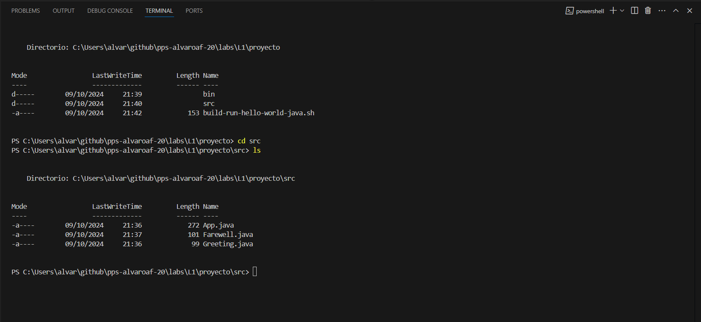
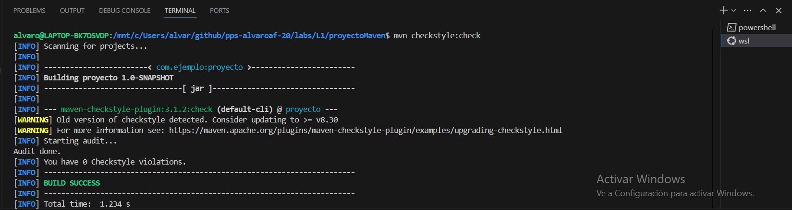
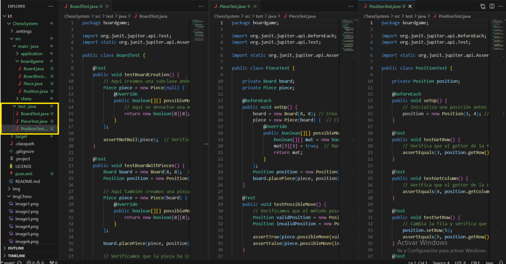
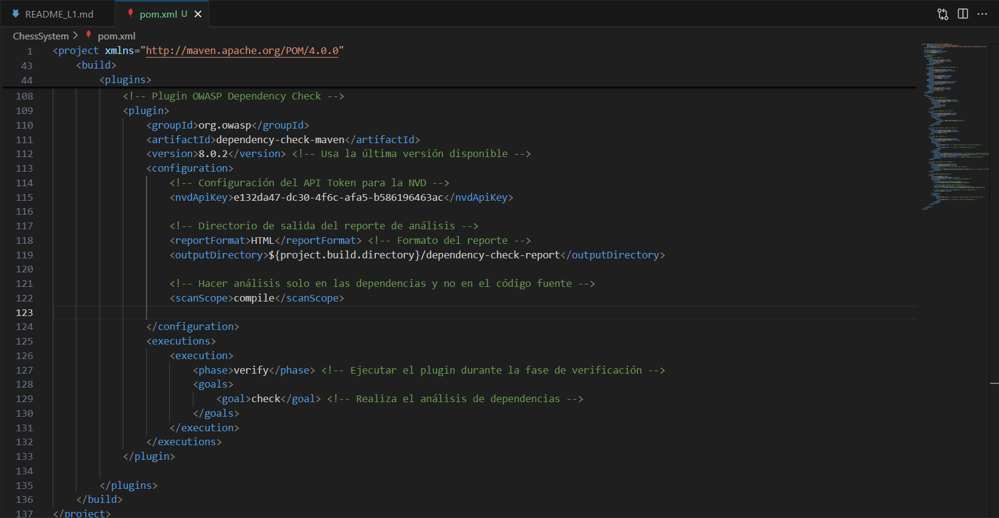
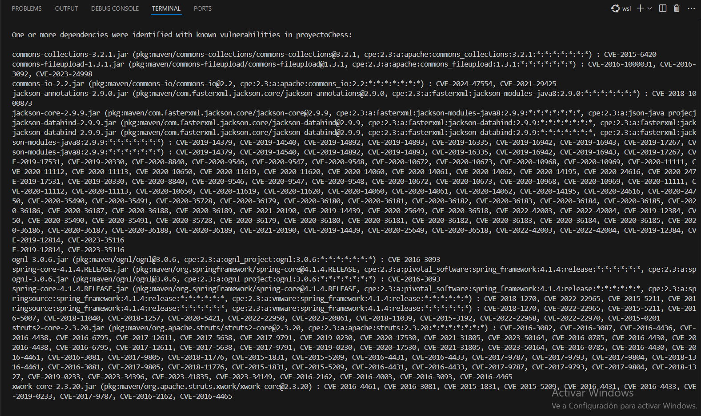
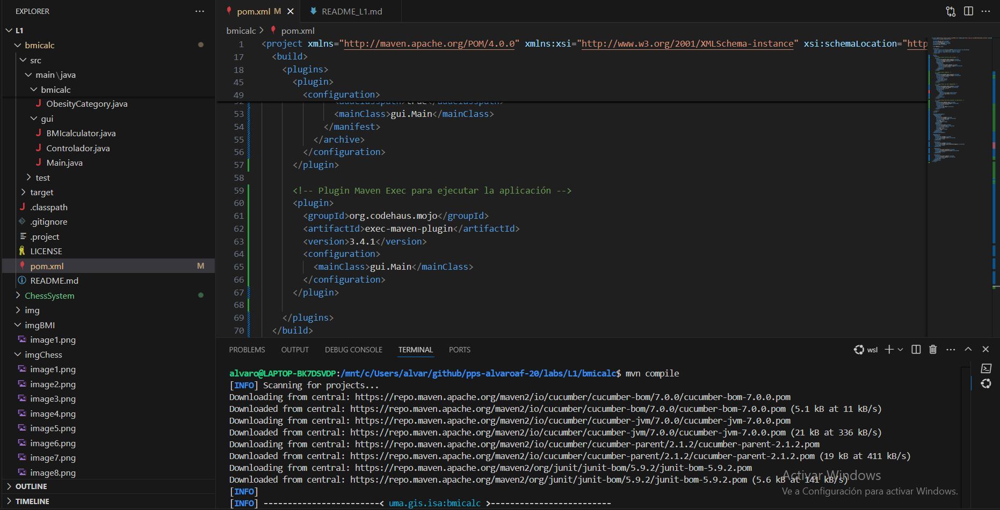
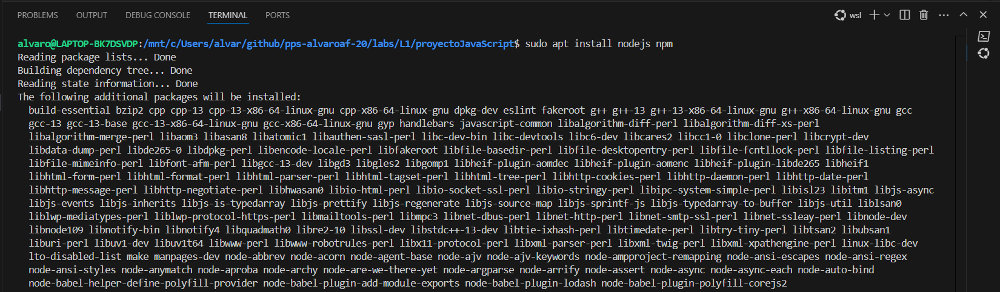
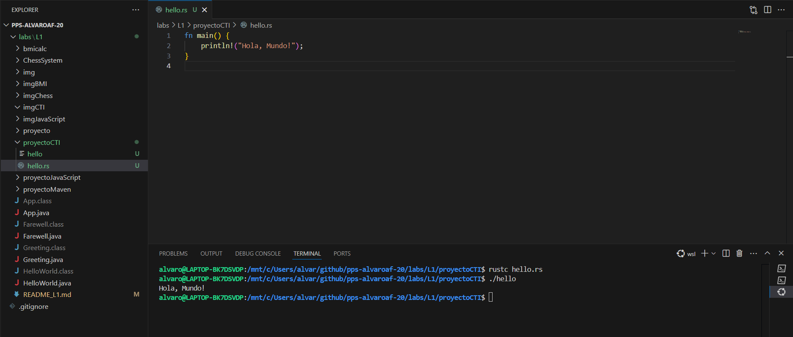

# Laboratorio 1

# Índice

- [Práctica 1.1. Java y Maven](#Practica-1.1.-Java-y-Maven)
- [Practica 1.2. Proyecto real usando Maven](#Practica-1.2.-Proyecto-real-usando-Maven)
- [Práctica 1.6. Compilado/Transpilado/Interpretado usando diferentes plataformas](#Práctica-1.6.-Compilado/Transpilado/Interpretado-usando-diferentes-plataformas)

# Practica 1.1. Java y Maven

### Realiza la práctica guiada de Java y MAVEN paso a paso para demostrar su desarrollo con evidencias.

## Crear una clase simple

En las siguientes capturas podemos observar como:

*  Importamos un codigo a un archivo .java

*  Compilamos el archivo  con el comando `javac "nombre del archivo.java"`

*  Ejecutamos en archivo usando `java "nombre del archivo"`

## Múltiples clases

En las siguientes capturas podemos observar como:

*  Importamos los codigos a los diferentes archivos java

*  Compilamos todos archivos  con el comando `javac "nombre del archivo.java"`

*  Ejecutamos solo el archivo principal `java "nombre del archivo"`

## Despliegue local básico

En las siguientes capturas podemos observar como:

*  Se crea la estructura sugerida

*  Creamos el codigo del sh 

*  Ejecutamos el codigo sh el cual creara la carpeta bin donde se guardara los archivos class y despues ejecutara el codigo

## Herramientas de Build: Maven

En las siguientes capturas podemos observar como:

*  Se crea la estructura de carpetas y se crea el archivo pom.xml 

*  Compilamos el proyecto con el comando `mvn compile"`

*  Una vez compilado ejecutamos el proyecto con el comando `mvn exec:java -Dexec.mainClass="App"`

## Empaquetar software: JAR

En las siguientes capturas podemos observar como:

*  Se inserta el plugin de jar en el pom.xml 

*  Empaquetamos  el proyecto con el comando `mvn package"`

*  Una vez empaquetado nos dirijimos a target y ejecutamos el proyecto con el comando `java -jar proyecto-1.0-SNAPSHOT.jar"`

## Herramientas de Build: Dependencias y Actualizar Dependencias

En las siguientes capturas podemos observar como:

*  Se añade una dependendia nueva a nuestro pom.xml

*  Importante desplazarse al directorio raiz del proyecto

*  Actualizamos las dependencias usando el comando  `mvn clean install`

## Pruebas software: JUnit

En las siguientes capturas podemos observar como:

*  Añadimos la dependencia del junit

* Modificamos con la nueva estructura y añadimos los archivos de test

*  Arrancamos los test con el comando  `mvn test`

## Herramientas de Build: Integrar pruebas

En las siguientes capturas podemos observar como:

*  Añadimos el plugin nuevo

*  Añadimos los archivos de test

*  Arrancamos los test con el comando  `mvn test`

## Generar Informes de Cobertura de Código en Proyectos Java con Maven

En las siguientes capturas podemos observar como:

*  Añadimos los plugin para generar informes de cobertura de codigos

*  Arrancamos los test con el comando  `mvn clean test`

*  Visualización del index que genera el informe 

## Integrar Checkstyle y OWASP Dependency Check en tu Proyecto Maven

En las siguientes capturas podemos observar como:

*  Insertamos los nuevos plugins necesarios 

*  Ejecutamos los comandos para que realize las comprobaciones

*  Visualización de las carpetas y archivos generados una vez ejecutados los comandos

## Generar un Informe de Pruebas Unitarias en Formato XML con el Plugin Surefire de Maven

En las siguientes capturas podemos observar como:

*  Insertamos el plugin necesario para generar el informe

*  Ejecutamos los comandos para que realize los test

*  Mostramos la ubicación donde se generan los informes

# Practica 1.2. Proyecto real usando Maven

### Dados los siguientes repositorios donde encontraremos programado en JAVA las siguientes aplicaciones:

### Juego de Ajedrez en terminal (https://github.com/eliezergarbin/ChessSystem) - (1 punto).
### Calculadora de BMI (https://github.com/claudiavegarodriguez/bmicalc/) - (1 punto).
### Debemos realizar las siguientes tareas para cada uno de los proyectos anteriores

## Adaptar la estructura de directorios para ser un proyecto en Maven. (Ajedrez)

En la siguiente captura podemos observar como:

*  Se crea la estructura sugerida

## Crear el fichero pom.xml y mostrar que el proyecto se compila y ejecuta correctamente. (Ajedrez)

En la siguientes capturas podemos observar como:

*  Se crea el pom.xml
*  Se  compila y ejecuta el programa indicando la localización del archivo principal

## Genera el empaquetado en JAR usando Maven. (Ajedrez)

En la siguientes capturas podemos observar como:

*  Se actualiza para usar el jar el pom.xml
*  Se empaqueta el proyecto y se ejecuta el programa 

## Incluye las dependencias de Test y ejecuta los Test de los proyectos. (Ajedrez)

En la siguientes capturas podemos observar como:

*  Se actualiza el pom.xml para poder realizar los test
*  Se crea la estructura de los test (para la pueba solo he realizado los test de la carpeta boardgame) y se ejecuta los test que finalmente se muestra el resultado por terminal

## Incluye el plugin checkstyle e integralo en la compilación. (Ajedrez)

En la siguientes capturas podemos observar como:

*  Se crea el archivo checkstyle y se añade los plugins necesarios con la configuracion solicitada
*  Se realiza el comando para comprobar el estilo de mi proyecto 
*  Se realiza el comando para generar un reporte en html y finalmente se muestra ese reporte

## Incluye el plugin de OWASP Dependency check e integralo en la compilación. (Ajedrez)

En la siguientes capturas podemos observar como:

*  Se añaden los plugins con vulnerabilidades y el plugin de OWASP Dependency
*  Se ejecuta el comando para buscar vulnerabilidades 
*  Aparecen las siguientes vulnerabilidades:

1. commons-collections-3.2.1: Vulnerabilidad de ejecución remota de código (RCE) a través de deserialización insegura (CVE-2015-6420).

2. commons-fileupload-1.3.1: Expuesto a ataques de denegación de servicio (DoS) y problemas de manejo de archivos grandes (CVE-2016-1000031, CVE-2016-3092).

3. commons-io-2.2: Riesgo de desbordamiento de memoria y ejecución de código mediante deserialización insegura (CVE-2024-47554, CVE-2021-29425).

4. jackson-annotations/core/databind 2.9.9: Deserialización insegura que permite ejecución remota de código (CVE-2019-14379, CVE-2020-10672, y más).

5. ognl-3.0.6: Ejecución de código mediante expresiones OGNL manipuladas (CVE-2016-3093).

6. spring-core-4.1.4: Deserialización insegura y vulnerabilidad de inyección de datos en Spring Framework (CVE-2018-1270, CVE-2015-5211).

7. struts2-core-2.3.20: Famosas vulnerabilidades RCE explotadas globalmente, como en encabezados HTTP manipulados (CVE-2017-5638, CVE-2020-17530).

8. xwork-core-2.3.20: Ejecución remota de código mediante OGNL en Apache Struts (CVE-2016-4461, CVE-2016-2162).

## Incluye el plugin de cobertura de test e integralo en la compilación.(Ajedrez)

En la siguientes capturas podemos observar como:

*  Se añade el plugin de cobertura de test y la ejecucion del comando para que genere el informe
*  Visualizado de index en navegador

## Adaptar la estructura de directorios para ser un proyecto en Maven. (Calculadora BMI)

En la siguiente captura podemos observar como:

*  Se crea la estructura sugerida

## Crear el fichero pom.xml y mostrar que el proyecto se compila y ejecuta correctamente. (Calculadora BMI)

En la siguientes capturas podemos observar como:

*  Se crea el pom.xml
*  Se  compila y ejecuta el programa indicando la localización del archivo principal

## Genera el empaquetado en JAR usando Maven. (Calculadora BMI)

En la siguientes capturas podemos observar como:

*  Se actualiza para usar el jar el pom.xml
*  Se empaqueta el proyecto (sin añadir los test porque todavia no estan configirados para añadirlos) y se ejecuta el programa 

## Incluye las dependencias de Test y ejecuta los Test de los proyectos. (Calculadora BMI)

En la siguientes capturas podemos observar como:

*  Se actualiza el pom.xml para poder realizar los test y se ejecuta el comando para realizarlos
*  Se ve el resultado de los test, los test usados han sido los que vienen en el proyecto, he tenido que realizar una modificación ya que no se estaba parseando a string adecuadamente una salida de una función

## Incluye el plugin checkstyle e integralo en la compilación. (Calculadora BMI)

En la siguientes capturas podemos observar como:

*  Se crea el archivo checkstyle y se añade los plugins necesarios con la configuracion solicitada
*  Se realiza el comando para comprobar el estilo de mi proyecto (he usado mvn checkstyle:checkstyle porque el check no me pillaba bien la configuracion de convertir los errores en warning )
*  Se realiza el comando para generar un reporte en html 

## Incluye el plugin de OWASP Dependency check e integralo en la compilación. (Calculadora BMI)

En la siguientes capturas podemos observar como:

*  Se añaden los plugins con vulnerabilidades y el plugin de OWASP Dependency
*  Se ejecuta el comando para buscar vulnerabilidades 
*  Aparecen las siguientes vulnerabilidades:

1. commons-collections-3.2.1: Vulnerabilidad de ejecución remota de código (RCE) a través de deserialización insegura (CVE-2015-6420).

2. commons-fileupload-1.3.1: Expuesto a ataques de denegación de servicio (DoS) y problemas de manejo de archivos grandes (CVE-2016-1000031, CVE-2016-3092).

3. commons-io-2.2: Riesgo de desbordamiento de memoria y ejecución de código mediante deserialización insegura (CVE-2024-47554, CVE-2021-29425).

4. jackson-annotations/core/databind 2.9.9: Deserialización insegura que permite ejecución remota de código (CVE-2019-14379, CVE-2020-10672, y más).

5. ognl-3.0.6: Ejecución de código mediante expresiones OGNL manipuladas (CVE-2016-3093).

6. spring-core-4.1.4: Deserialización insegura y vulnerabilidad de inyección de datos en Spring Framework (CVE-2018-1270, CVE-2015-5211).

7. struts2-core-2.3.20: Famosas vulnerabilidades RCE explotadas globalmente, como en encabezados HTTP manipulados (CVE-2017-5638, CVE-2020-17530).

8. xwork-core-2.3.20: Ejecución remota de código mediante OGNL en Apache Struts (CVE-2016-4461, CVE-2016-2162).

## Incluye el plugin de cobertura de test e integralo en la compilación.(Calculadora BMI)

En la siguientes capturas podemos observar como:

*  Se añade el plugin de cobertura de test y la ejecucion del comando para que genere el informe
*  Visualizado de index en navegador

# Practica 1.3. JavaScript y Node.js

### Debe realizar los mismos pasos que se han realizado en la práctica guiada de JAVA pero usando un lenguaje de programación/entorno de desarrollo diferente.

## Instalación y configuración de Node.js

En la siguientes capturas podemos observar como:

*  Se descarga nodejs y npm
*  Para comprobar que se descarga correctamente se cisualiza las versiones
* Node.js es un entorno de ejecución de JavaScript en el servidor. Su arquitectura asincrónica y no bloqueante le permite manejar múltiples solicitudes de forma eficiente usando un solo hilo con un bucle de eventos, lo que evita la sobrecarga de múltiples hilos.

## Configurar un Proyecto Node.js

En la siguiente captura podemos observar como:

*  npm es un gestor de paquetes de Node.js que permite instalar, actualizar y gestionar bibliotecas y dependencias para proyectos Node
*  Para iniciar un proyecto node usamos npm init en cuan nos muestra toda la informacion que hay dentro del package.json (lo que se muestra en la imagen)
* para instalar dependencias se usa npm install nombre-dependencia y se guardan en una carpeta llamada node_modules

## Crear una Aplicación Simple

En la siguiente captura podemos observar como:

*  Se crea app.js 
*  Se realiza la instruccion node para ejecutar el app
* La diferencia que hay entre java/javac y node es que java primero compila el codigo (javac) y luego lo ejecuta (java) mientras que node interpreta y ejecuta directamente el codigo javascript ya que es un entorno interpretado

## Múltiples Módulos

En la siguiente captura podemos observar como:

*  Se crea farewell.js, greeting.js y se modifica app.js 
*  Se realiza la instruccion node para ejecutar el app que a su vez usa los otros archivos .js

## Despliegue Local Básico

En la siguiente captura podemos observar como:

*  Se modifica la estructura del proyecto
*  se crea el package json y como se ejecuta la aplicacion con npm start

## Empaquetar Software: npm

En la siguiente captura podemos observar como:

*  Se añade en el package.json para empaquetar el proyecto
*  Se usa el comando npm para empaquetar 
* Se muestra como instalar y ejecutar el paquete

## Dependencias

En la siguiente captura podemos observar como:

*  Se instalan las dependencias mas comunes usando npm-nombreDependencia y se ven las descargadas en el package.json y node_modules
*  Depencendias comunes:
1. Express

Descripción: Framework web para Node.js que facilita la creación de aplicaciones web y APIs. Simplifica el manejo de rutas, middleware y solicitudes HTTP.

2. Mongoose

Descripción: Biblioteca de modelado de objetos MongoDB para Node.js, que facilita la interacción con bases de datos MongoDB mediante un esquema estructurado.

3. Axios

Descripción: Cliente HTTP basado en promesas para realizar solicitudes HTTP en el navegador y en Node.js, muy utilizado para consumir APIs.

4. Lodash

Descripción: Biblioteca de utilidades que facilita el trabajo con arrays, objetos y otras colecciones de datos, ofreciendo funciones muy utilizadas en el desarrollo de JavaScript.

5. dotenv

Descripción: Permite cargar variables de entorno desde un archivo .env para manejar configuraciones sensibles (como claves de API) fuera del código fuente.

6. Nodemon

Descripción: Herramienta para desarrollo que automáticamente reinicia el servidor de Node.js cuando detecta cambios en los archivos de la aplicación.
7. Jest

Descripción: Framework de pruebas de JavaScript, ideal para realizar pruebas unitarias y de integración en aplicaciones Node.js.
8. CORS

Descripción: Middleware para habilitar solicitudes entre dominios (CORS) en aplicaciones Express, permitiendo que se hagan peticiones desde otros orígenes.

## Pruebas de Software: Mocha y Chai

* No heconseguido solucionar un erroe que me sale antes de la fecha limite

# Práctica 1.6. Compilado/Transpilado/Interpretado usando diferentes plataformas
### Lenguaje compilado

### Lenguaje Interpretado

### Lenguaje Traspilado
