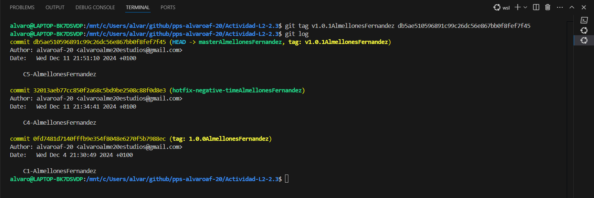
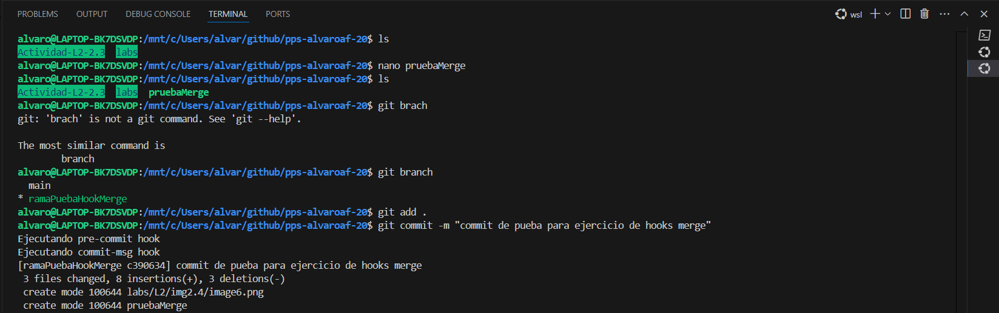
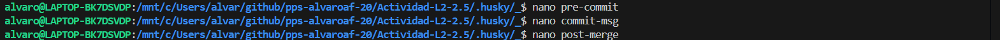
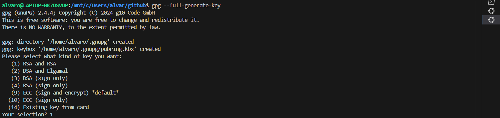
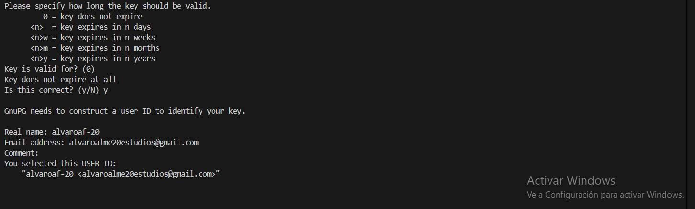
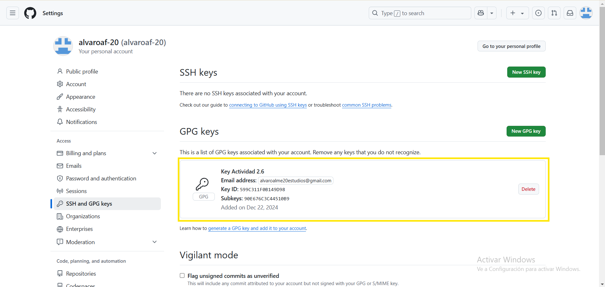
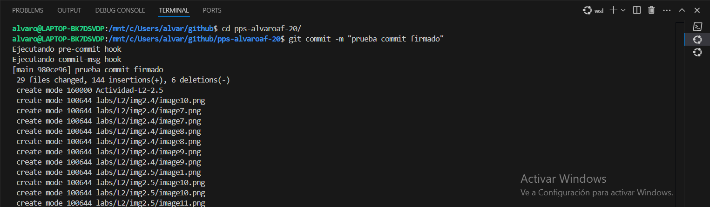
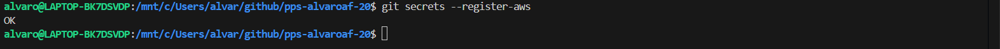

# Laboratorio 2

# Índice

- [Práctica 2.1](#id1)
- [Práctica 2.2](#id2)
- [Práctica 2.3](#id3)
- [Práctica 2.4](#id4)
- [Práctica 2.5](#id5)
- [Práctica 2.6](#id6)
- [Práctica 2.7](#id7)
- [Práctica 2.8](#id8)
- [Práctica 2.9](#id9)

# Práctica 2.1. Configuración de GIT 

### Realiza la práctica guiada para configurar GIT en tu entorno de trabajo.

*  Aqui se realiza la configuración del nombre y del correo de GIT

*  Aqui se realiza la configuración del editor de texto te que va a usar git, en mi caso he usado nano 

*  Aqui se realiza la una prueba de como se pueden usar alias para abreviar comandos de git, se suele realizar para los comandos mas frecuentes, en este caso el git status, despues se ve el comando que quita el alias

*  En esta imagen se ve el .gitignore que configure segun mis necesidades con forme a la practica anterior, este archivo es el encargado de decirle a git que cosas se tienen que ignorar a la hora de subir el proyecto.

*  Aqui se usa el comando que habilita el almacenamiento de las credenciales en caché para no tener que estar poniendo el usuario y la contraseña cada vez que se quiere interactuar con un repositorio remoto, este comando por defecto lo almacena durante 15 minutos, si quieres aumentar el tiempo, se usa el siguiente comando que se observa en la imagen

# Práctica 2.2. Trabajando con GIT básico 

### Haciendo uso de algún proyecto “real” descargado desde el repositorio GitHub (consultar con el profesor antes de tomar un repositorio, puesto que debe ser de un proyecto real de gran envergadura), demostrar que sabéis usar los comandos útiles de Git para observar el repositorio de dicho proyecto (git log, git diff, git blame y git show).

### Por cada uno de estos 4 comandos, hay que evidenciar 4 capturas (junto a su explicación, ejemplo y todo lo que se desee aportar) de diferentes usos (opciones) del mismo comando. Junto a cada captura, hay que explicar con vuestras palabras lo que se quiere probar, demostrar o buscar con ese comando/opción.

En mi caso de he usado el proyecto del ajedrez usado en el primer laboratorio

-  GIT LOG

   
      - Este comando git log es simple pero muy util ya que te permite realizar un log de los ultimos X commits que se han realizado, siendo X la cantidad de commits que quieras observar , es este caso 3

   
      - Este comando git log en adicion al anterior contiene el " --stat " que se usa para ver las estadisticas detallas sobre los commit, como se puede observar en el ejemplo , en el commit concreto se ha modificado el README 

   
      - Este comando git log te proporciona una visión simple de los commit junto a su ID y título , en este caso te muestra solo 10 

   
      
      - Este comando git log te muestra  3 logs en los que se ha modificado en este caso la carpeta src pero se puede especificas el archivo o carpeta que se desee que se encuentre en el proyecto

- GIT DIFF

      
      - El comando git diff sirve para visualizar las diferencias que se encuentran entre el directorio de trabajo y del staging pero todavía no han sido subidos al staging

      
      - Este comando git diff hace una comparación  de dos commit en concreto 

      
      - Este comando git diff compara un archivo concreto del directorio de trabajo con la versión en HEAD , en este caso ha sido el README del proyecto el cual le he hecho una pequeña modificación 

      
      - Este comando git diff es util para comparar el ultimo commit realizado con lo que hay subido al staging, por ello previamente al comando he usado git add . con un pequeño cambien en el readme del proyecto 

- GIT SHOW
    
      
      - Este comando git show te muestra los cambios de un commit en concreto

      
      - Este comando git show te muestra un archivo en concreto de  un commit en concreto 

      
      - Este comando git show te muestra las "estadisticas" de las variaciones de un commit, esto es util si simplemente quieres ver que archivos se han modificado pero no quieres ver en concreto las lineas de codigo

      
      - Este comando git show te muestra las variaciones de una rama en concreto

- GIT BLAME
      
      - Este comando te muestra quien y cuando ha modificado un archivo en concreto

      
      - Este comando git blame te muestra ente X y X lineas quien y cuando lo ha modificado un archivo en concreto. En este caso muestra quien y cuando se ha modificado entre la linea 10 y 20 del README

      
      - Este comando git blame te muestra en que commit se añadio una línea de codigo

      
      - Este comando git blame es un git blame normal pero con mas información sobre un archivo en concreto

# Práctica 2.3. Ejercicio Práctico: Uso de Comandos de Git y Gitflow 

### Secuencia del Proyecto

Una posible secuencia del proyecto podría ser la siguiente (obtenido del libro _Git, Controle la gestión de sus versiones - Samuel Dazón_):

### 1. **C1 (master)**: Primer commit del proyecto. Este commit añade la base del proyecto en el repositorio. _(Tag: versión v1.0.0)._

 

- En esta primera imagen nos encontramos con el comando `git init ` que su funcon es crear en el directorio en el que nos encontramos la inicialización del proyecto añadiendo el subdirectorio `.git` que almacena todo lo que es la configuración y historial

 

En esta imagen nos encontramos con diferentes comandos que no han aparecido anteriormente que son los siguiente:

- El comando ` git add .` que su funcion es agregar todos los archivos nuevos o modificados del directorio en el que nos encontramos al staging area 
- El comando ` git commit -m "mensaje personalizado"` como su nombre indica es el encargado de realizar un commit con los cambios añadidos en el staging area previamente añadido con ` git add .`, para realizar un commit es necesario añadir un mensaje para asociar a ese commit que se pone con ` -m "mensaje"`
- El comando ` git tag "nombre del tag"` esta variante de git tag como su nombre indica añade un tag al ultimo commit subido, mas adelante se verá la variante de añadir un tag a un commit en específico
- El comando `git branch -m "nombre rama"`, este comando lo he usado para personalizar la actividad, ya que me pedian que agregara mis apellidos a la rama master, entonces su funcion es cambier el nombre a la rama actual en la que te encuentras
- El comando ` git log ` en cual comento su utilidad en el ejercicio anterior

### 2. **C2 (develop)**: Creación de la rama `develop`. Después de este commit, las dos ramas principales están creadas.

 

En esta imagen podemos observar un comando nuevo:

-  El comando `git checkout -b "nombreRama"` el cual su funcionalidad es crear una rama y a parte desplazarte a la rama creada
- Despues para completar el apartado, una vez el la rama nueva, modifico el archivo de prueba , añado los cambios a staging con `add` y realizo el `commit ` , finalmente muestro que se ha realizado correctamente

### 3. **C3 (graph_employee)**: Creación de una rama para añadir gráficos en la página de los trabajadores (creado por Programador Nº 2).

 

- En esta imagen realizo los mismos comandos que antes, modifico el archivo,subo a staging,hago el commit y lo muestro en la siguiente imagen

 

### 4. **C4 (hotfix-negative-time)**: Creación de una rama para gestionar el caso en que un trabajador introduzca un valor negativo en una tarea.

 

En esta imagen podemos ver dos comandos nuevos 

- El comando `git branch` ,anteriormente hemos visto una variacion con el -m que era para cambiar el nombre de la rama actual, pero en este caso este comando te muestra las ramas que tiene el repositorio y en cual te encuentras.
- El comando `git checkout "nombre rama"` ,anteriormente hemos visto una variacion con el -b que era para crear una rama y desplazarte a ella, pero en este caso este comando solo te desplaza a una rama ya existente .
- Despues observamos la combinación de comandos explicados anteriormente para lograr realizar este apartado correctamente
### 5. **C5 (master)**: Integración del parche en la rama `master`. _(Tag: versión v1.0.1)._

 

 En esta imagen observamos un comando nuevo:

- El comando `git merge "nombre rama"` que su funcion es fusionar los cambios de la rama que se especifica en la rama en la que nos encontramos actualmente combinando el historial y los cambios de la rama especificada con la actual. Normalmente se suele usar para integrar una rama secundaria a una principal
- Despues he usado la combinacion de comandos explicados anteriormente de forma correcta para lograr el objetivo del enunciado

 

 

- En esta ultima imagen se observa una variante nueva del comando explicado ya git tag pero con la siguiente forma `git tag "nombreTag" "hashCommitEspecifico"`, esta variante asigna un tag a un commit especifico usando su hash
### 6. **C6 (develop)**: Integración del parche en la rama `develop`.

 

 
 
 

En este apartado quiero destacar tambien que algunas veces cuando haces un merge puede que haya conflictos entre archivos , ya que en las dos ramas se encuentra un archivo con cosas distintas, para solucionarlo tienes que dejar la versión que quieras y hacer un add y un commit como se ven en las imagenes anteriores de este apartado

### 7. **C7 (task_type)**: Creación de una rama para añadir el tipo de tareas.

 
 
### 8. **C8 (graph_employee)**: Último commit de la rama `graph_employee`.

 
 
### 9. **C9 (develop)**: Integración de la rama `graph_employee` en `develop`. Se elimina la rama `graph_employee`.

 
 
 
 
 
 
 
 
### 10. **C10 (task_type)**: Último commit de la rama `task_type`.

  

### 11. **C11 (develop)**: Integración de la rama `task_type` en `develop`.

 
 
 

### 12. **C12 (release-V1.1)**: Creación de la rama para la versión 1.1.

 

### 13. **C13 (export_csv)**: Creación de una rama para agregar una funcionalidad de exportar a CSV las tareas de un empleado durante un periodo.

 

- 
### 14. **C14 (release-V1.1)**: Parche para corregir un error en el gráfico cuando el trabajador no tiene tareas.

 

### 15. **C15 (master)**: Integración de la versión 1.1 en la rama `master`. _(Tag: versión v1.1)._

 
 
 
 
### 16. **C16 (develop)**: Integración del parche de la versión 1.1 en la rama `develop`.

  

### 17. **C17 (export_csv)**: Último commit de la rama `export_csv`.

 

### 18. **C18 (develop)**: Integración de la rama `export_csv` en `develop`.

 

  

 

## Resultado Final

 

Este seria el resultado final del historial de todas las ramas. 

En los apartados finales no he escrito mucho texto porque realmente solo usaba los comandos que he explicado en las primeras imagenes y pienso que sería muy repetitivo volver a decir lo mismo en todas las imagenes

# Práctica 2.4. Configurando hooks de GIT (1 punto) 

En esta práctica, aprenderás a configurar y utilizar hooks en GIT para automatizar tareas comunes en tu flujo de trabajo. Los hooks son scripts que GIT ejecuta automáticamente en ciertos puntos del ciclo de vida de los commits y otras acciones de GIT. 

### Objetivos:

1. Configurar un hook pre-commit para verificar el formato del código antes de permitir un commit.
2. Configurar un hook commit-msg para asegurar que los mensajes de commit sigan un formato específico.
3. Configurar un hook post-merge para ejecutar pruebas automatizadas después de una fusión.

## Instrucciones:

### 1. Crea un repositorio GIT nuevo o utiliza uno existente.

En nuestro caso voy a usar mi propio repositorio de git para que luego se pueda ver que se ha realizado el ejercicio a parte de las capturas

### 2. Navega al directorio `.git/hooks` dentro de tu repositorio.

 

### 3. Copia y pega los scripts en los archivos correspondientes dentro del directorio `.git/hooks`

 
 
 

### 4. Asegúrate de que los scripts sean ejecutables
 
### 5. Pruebas para verificar que los hooks funcionan correctamente.

 

- Como podemos ver en la imagen anterior, al realizar un commit se ve como se ejecutan el hook de pre-commit y el commit-msg , los cuales ya se pueden configurar segun tus necesidades en el proyecto por si tienes que tener un patron especifico en los mensajes de los commit o en la forma de hacer los commits como tal

 

- Ahora vamos a comprobar que se ejecuta el hook de merge, para ello hemos creado una rama de prueba 

 

- vamos a crear un archivo nuevo de prueba para realizar un commit en la rama de prueba para posteriormente realizar el merge. Como se puede ver tambien en la imagen anterior en esta rama al hacer commit tambien se lanzar los hooks de commit ya que se lanzar en todo el repositorio

 

- Ahora nos cambiamos a la rama main y se puede comprobar en la imagen anterior poque en el log no se encuentra el commit de la otra rama

 

- Con el comando git branch corroboro mas todavia que estamos en la rama main y finalmente realizamos un merge de la rama de prueba y observamos dentro del cuadrado amarillo que se lanza el hook de merge

# Práctica 2.5. Configurando hooks usando Husky (1 punto) 

En esta práctica, aprenderás a configurar y utilizar Husky para gestionar hooks en GIT de manera más sencilla y eficiente. Husky es una herramienta que facilita la creación y gestión de hooks en GIT, permitiendo automatizar tareas comunes en tu flujo de trabajo.

### Objetivos:
1. Instalar Husky en un proyecto GIT.
2. Configurar un hook pre-commit para verificar el formato del código antes de permitir un commit.
3. Configurar un hook commit-msg para asegurar que los mensajes de commit sigan un formato específico.
4. Configurar un hook post-merge para ejecutar pruebas automatizadas después de una fusión.

## Instrucciones:

### Si quieres puedes ver lo que he hecho en la carpeta Actividad-L2-2.5 , le he cambiado a la carpeta .git el nombre a git oculto 

### 1. Crea un repositorio GIT nuevo o utiliza uno existente.

 

- Para esta practica he creado un repositorio en un directorio nuevo

### 2. Asegúrate de tener Node.js y npm instalados en tu sistema.

 

### 3. Instala Husky en tu proyecto

 

### 4. Inicializa Husky en tu proyecto

 

- Como podemos ver al usar este comando se nos genera la carpeta ` .husky` , ` node modules `, y dos archivos .json 

### 5. Configura los hooks utilizando Husky

 

 

- Como podemos observar en estas imagenes aparecen todos los archivos de hooks dentro de ` .husky ` , he estado intentando usar los comandos del ejercicio para configurar los hooks pero me pone que estan DEPRECATED y no me los modificaba . Asi que vi que para modificarlos tenia que quitar las lineas que te dice el ` husky.sh  ` . En las siguientes imagenes se va a mostrar que pongo en cada archivo y la ultima imagen es como estan los archivos predeterminados de los hooks . 

 

 

- Archivo pre-commit

 

- Archivo commit-msg

 

- Archivo post-merge

 

- Archivo predeterminado, al cual si quieres usarlo debes de quitarle esta lineas

### 6. Realiza pruebas para verificar que los hooks funcionan correctamente

 

- Como se puede observar , hago un add y un commit de un rachivo de prueba y se ejecuta los hooks de husky

 

- Lo mismo pasa cuando hago un commit en la otra rama y a la hora de realizar el merge se ejecuta el post-merge de husky

# Práctica 2.6. Firmando commits (1.5 puntos) 

En esta práctica, aprenderás a firmar tus commits en GIT utilizando GPG (GNU Privacy Guard) para asegurar la autenticidad e integridad de tus cambios. Firmar tus commits añade una capa adicional de seguridad y confianza, permitiendo a otros verificar que los commits realmente provienen de ti. Además, podrás ver la verificación de tus commits firmados en plataformas como GitHub.

### Objetivos:
1. Generar una clave GPG si no tienes una.
2. Configurar GIT para usar tu clave GPG.
3. Firmar tus commits con GPG.
4. Verificar la firma de tus commits en GitHub.

### Instrucciones:

### 1. Generar una clave GPG

 

- Usamos el comando ` gpg --full-generate-key` para generear las keys, esta modalidad del comando te permite configurar muchos apartados de tu key como por ejemplo se ve en la imagen anterior el timo de kay quieres. 

 

- En esta imagen elegimos como de largo queremos que sea la key

 

- En esta imagen elegimos cuanto tiempo queremos que sea valida la key, para esta prueba no tiene tiempo de expiracion pero para que sea mas segura deberia tener un tiempo de expiracion. Ponemos nuesto nombre, el correo que tiene que ser importante que sea el mismo que se usa en github.

 

- Esta es la parte final de la configuración donde, una vez que finalizas, te pide que pongas una contraseña en una ventana a parte para introducirla cuando se usa la key

### 2. Configurar GIT para usar tu clave GPG

 

- con el comando `gpg --list-keys` te muestra todas las keys que has creado y con el comando ` gpg --armor --export "id de la key"` te muestra la key completa para exportarla. Como se puede observar a partir de aqui uso una key diferente a la que cree anteriormente ya que me daba errores para hacer los commits, pensando que era culpa de la key genere una nueva pero seguia sin funcionarme  y al final era un error de exportación de  las keys con WSL de Windows pero tenia todo git y github ya configurado con la nueva key y por eso uso la nueva

 

- Con los comandos usados en el laboratorio 2:
- añado las globales de la key con su id :`git config --global user.signingkey <tu_clave_gpg>`
- añado que se firmen los commit con las keys:`git config --global commit.gpgSign true`
 

 

- Ahora vamos a configurar GitHub para que use la misma key, para ello en la parte superior derecha de la pantalla en la imagen de nuestro perfil hacemos click y despues a settings y llegariamos a la imagen anterior

 

- Ahora nos direigimos a la parte de SSh y GPG key y nos saldria esta imagen 

 

- Ahora le damos a nueva key GPG y nos saldria esta imagen

 

- Ahora volvemos a nuestro listado de keys y añadimos la key entera como se explica en el box donde se tiene que añadir y le ponemos un nombre que queramos a la key

 

- Despues de añadir la key  y ponerle un nombre le damos al botón de añadir key y te devuelve a la pantalla de settingd pero deberias ver una key como esta con tus parametros.

### 3. Firmar tus commits con GPG

 

- Ahora al realizar los commit te pide la contraseña que le pusiste a la key asignadoa y si la escribes correctamente se realiza el commit.

### 4. Verificar la firma de tus commits en GitHub

 

- Una vez realizados los commits para comprobar la firma en github realizamos un push y si nos vamos al apartado de commits de nuestro repositorio, podemos observar que los commits firmados tienen un sello de color verde con la palabra "Verified" dentro 

# Práctica 2.7. Securizando GIT: Git-Secrets (1.5 puntos) 

En esta práctica, aprenderás a utilizar `git-secrets` para evitar que información sensible, como claves API y contraseñas, se incluya accidentalmente en tus commits de GIT. `git-secrets` es una herramienta que escanea tus commits y previene que información sensible sea añadida al repositorio.

## Objetivos:
1. Instalar `git-secrets` en tu sistema.
2. Configurar `git-secrets` en un repositorio GIT.
3. Añadir patrones para detectar información sensible.
4. Probar `git-secrets` para asegurarte de que funciona correctamente.

### Instrucciones:

### 1. Instalar `git-secrets`

 

- Para instalar git-secrets clonamos el repositorio de secrets, accedemos a la carpeta que se genera y usamos el make install para instalar git-secrets en nuestro equipo

### 2. Configurar `git-secrets` en tu repositorio

 

- Una vez realizado el paso anterior hay que inicializar git secret en nuestro repositorio con los comandos que se ven en la imagen. He tenido que forzar el comando por los hooks que 
tenia creados anteriormente de la practica anterior

 

- Ahora vamos a añadir los patrones de AWS para que al realizar un commit o se escanee el repositorio, si hay una posible variable de AWS con contraseña o algo que deberia de ser privado, te lo reconoce y en caso de intentar hacer un commit te lo bloquea hasta que la quites , para evitar posibles filtraciones

### 3. Probar `git-secrets`
 

- Aqui se puede observar como intento realizar una prueba para comprobar de que si tengo una variable de aws en uno de mis archivos del repositorio , al realizar un commit me lo bloquea pero no he conseguido que me funcione , y me parece raro poruq en las siguientes imagenes se ùede observar como aparecen los patrones de AWS en la lista de secrets, sospecho que pueda ser un problema de WSL pero no he conseguido resolverlo

### 4. Verificar la configuración

 

- En esta imagen podemos ver los hooks de secrets y la lista de patrones que tiene

### 5. Añadir patrones personalizados

 

- Aqui realizo un patron para bloquear posibles correos,realizo un cambio en el archivo test y añado un ejemplo de correo y al realizar el commit me lo bloquea.

# Práctica 2.8. Securizando GIT: Trufflehog: Local (1.25 puntos) 

En esta práctica, aprenderás a utilizar TruffleHog para escanear tu repositorio GIT en busca de información sensible, como claves API y contraseñas, que puedan haberse incluido accidentalmente en tus commits. TruffleHog es una herramienta que busca patrones de información sensible en el historial de commits de tu repositorio.

### Objetivos:
1. Instalar TruffleHog en tu sistema.
2. Configurar TruffleHog para escanear un repositorio GIT local.
3. Ejecutar TruffleHog para detectar información sensible en el historial de commits.
4. Analizar los resultados del escaneo y tomar medidas para eliminar cualquier información sensible encontrada.

### Instrucciones:

### 1. Instalar TruffleHog

 

- Instalo el TruffleHog con el  comando que se ve en la imagen

### 2. Configurar TruffleHog para escanear un repositorio GIT local

- Esta instruccion creo que se puede omitir porque justo han actualizado trufflehog y no he encontrado ninguna forma de configurarlo, analiza el repositorio automáticamente
### 3. Ejecutar TruffleHog

 

- Con el comando que se ve e la imagen analizo el repositorio git local, en la nueva actualización de trufflehog explica que para analizar el repositorio no puedes estar dentro de la carpeta que tiene el .git, de echo si lo ejecutar ahi no lo analiza

### 4. Analizar los resultados del escaneo

- Como podemos ver en el cuadrado amarillo de la imagen anterior no ha analizado secretos en commit realizados con desconocidos ni verified , es decir , los commit firmados y sin firmar

### 5. Verificar la eliminación de información sensible

- No he eliminado nada ya que no hay información sensible, en el siguiente paso se provocará una vulnerabilidad para eliminarala

### 6. Provoca una vulnerabilidad y localizala

 

- Como se ve en la imagen de arriba, he creado un archivo ` .env` con una vulnerabilidad dentro y he realizado un commit de este.  

 

- Ahora volvemos a analizar el repositorio con trufflehog y nos damos cuanta de que aparece que en un commit hay un secreto.

 

- Una vez hemos detectado el commit vamos a proceder a eliminarlo del historial de commit para evitar que nos roben esa información. Para ello vemos todos los commit que hemos realizado y buscamos el commit con el mismo hash que detecto trufflehog. Para eliminarlo vamos a usar el comando ` git rebase -i HEAD~"numero de commit que quieres acceder a modificar"` 

 

- Unavez seleccionamos los commit que queremos modificar, en mi caso uno ya que tiene la vulnerabilidad en el ultimo commit que he realizado, se habre un archivo el cual aparece el commit/commits que has elegido que aparezcan, para eliminarlo del historial de commits hay que ponerlo drop delante como se puede ver en la imagen.

 

- Una vez que guardamos y cerramos el archivo, se elimina el commit del historial.

 

- Para comprobarlo que se a eliminado correctamente volvemos a analizar el repositorio con trufflehog y vemos que no encuentra ningun secreto

# Práctica 2.9. Securizando GIT: Trufflehog: Remoto (1.25 puntos) 

En esta práctica, aprenderás a utilizar TruffleHog para escanear un repositorio GIT remoto en busca de información sensible.

### Objetivos:
1. Configurar TruffleHog para escanear un repositorio GIT remoto.
2. Ejecutar TruffleHog para detectar información sensible en el historial de commits del repositorio remoto.
3. Analizar los resultados del escaneo y tomar medidas para eliminar cualquier información sensible encontrada.

### Instrucciones:

### 1. Configurar TruffleHog para escanear un repositorio GIT remoto

- Como he comentado en la practica anterior en la ultima version de trufflehog no he encontrado nada que se puede configurar, lo hace todo automaticamente

### 2. Ejecutar TruffleHog

 

- Para realizar un analisis en remoto hay que pasarle la url a trufflehog como se ve en la imagen, yo he usado de ejemplo la url del repositorio de Ajedrez del laboratorio anterior

### 3. Analizar los resultados del escaneo

- Como podemos observar el repositorio de Ajedrez no tienen ningun secreto en sus commits .

### 4. Verificar la eliminación de información sensible

- No he tenido que eliminar información sensible ya que el ajedrez no tiene .