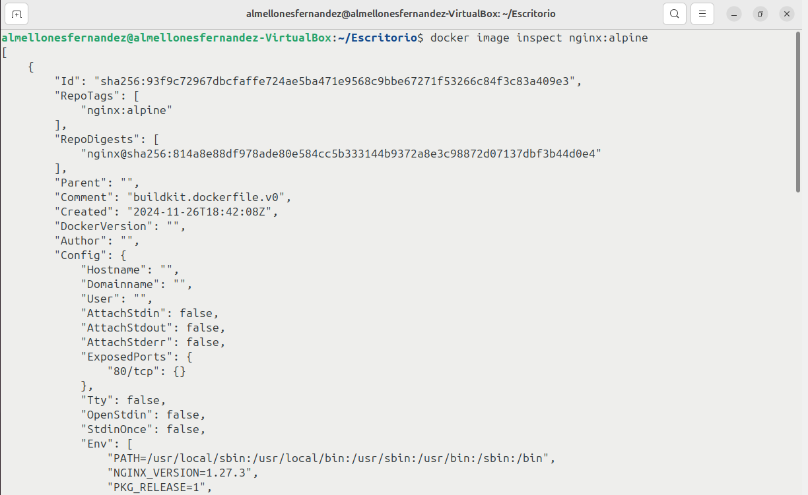
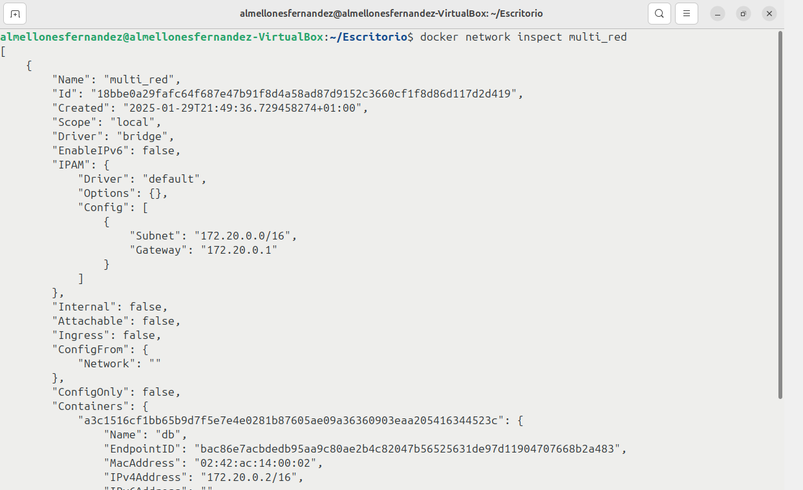
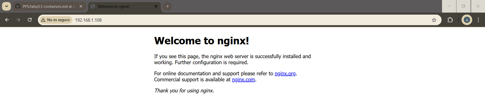
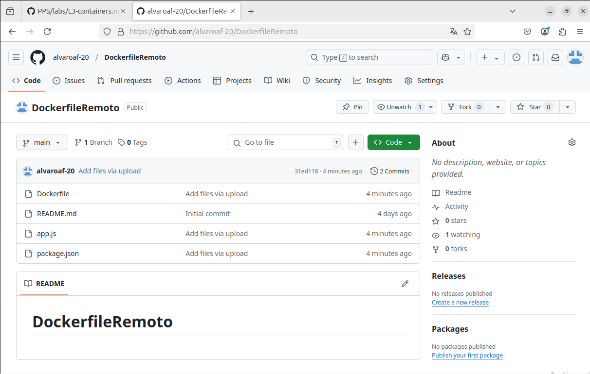
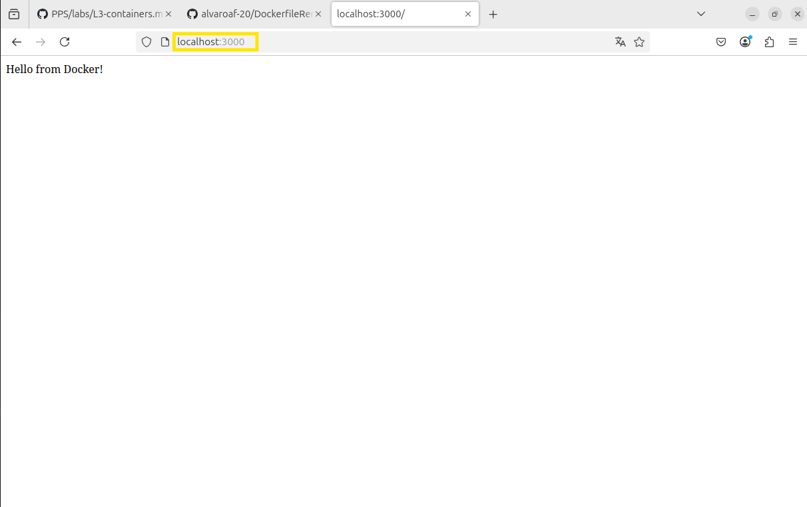
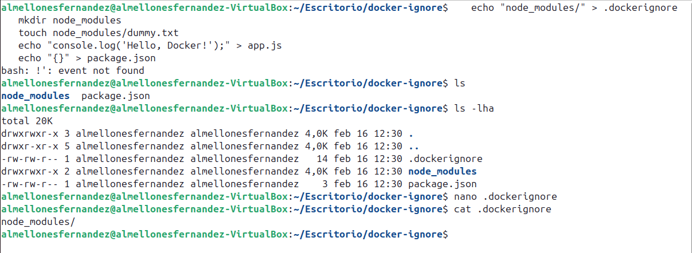
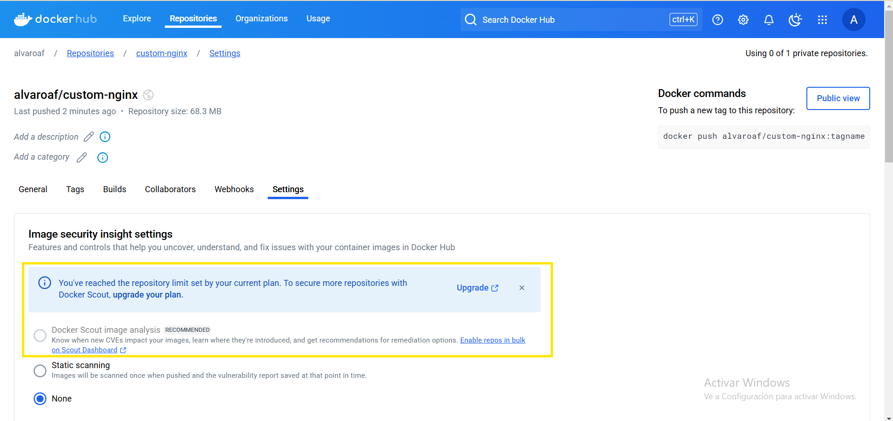
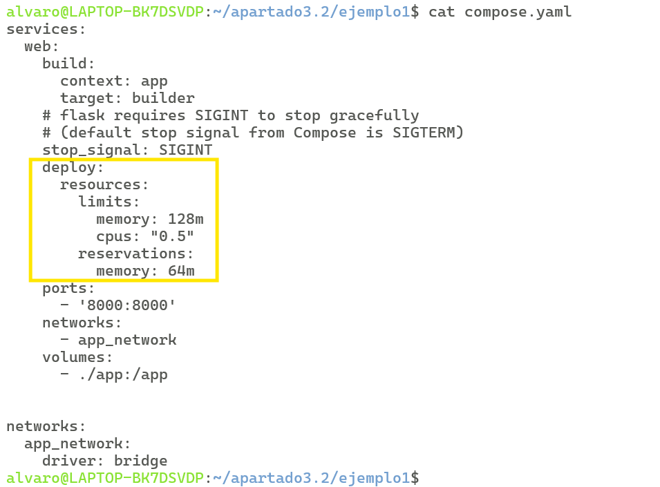

# Laboratorio 3

# Índice

- [Práctica 3.1](#id1)
    - [Configuración Inicial](#id2)
    - [Primeros Pasos: Diferencia entre Imagen y Contenedor](#id3)
    - [Primeros Pasos: Redes](#id4)
    - [Persistencia de datos](#id5)
    - [Construyendo nuestras propias imágenes](#id6)
    - [Docker-Compose](#id7)
    - [Securización](#id8)
    - [Docker scout](#id9)     
- [Práctica 3.2](#id10)
    - [Docker-Compose FLASK](#id11)
    - [Docker-Compose OneDev](#id12) 

# Práctica 3.1. Uso de contenedores  

## Realiza la práctica guiada de contenedores. Paso a paso.

La puntuación es la siguiente:

- Configuración Inicial (0.25 puntos)
- Primeros Pasos: Diferencia entre Imagen y Contenedor (0.25 puntos)
- Primeros Pasos: Redes (0.75 puntos)
- Persistencia de datos (0.75 puntos)
- Construyendo nuestras propias imágenes (1.50 puntos)
- Docker-Compose (0.75 puntos)
- Securización (0.75 puntos)
- Docker scout (1 punto)

## 1. Configuración Inicial 

Antes de instalar docker vamos a actualizar el sistema

Con el comando ` sudo apt-get install docker.io ` instalamos docker 

Una vez instalado docker vamos a arrancarlo con systemctl start docker y con el systemctl status docker comprobamos que esta activo

Ahora vamos a añadir nuestro usuario del sistema al grupo de docker para poder poder ejecutar los comandos de docker sin la necesidad del sudo. Importante de reiniciar una vez ejecutado el comando para que se apliquen los cambios

Una vez reiniciado el equipo para comprobar que se han aplicado los cambios usamos el comando ` docker run hello-world ` sin el sudo  

## 2. Primeros Pasos: Diferencia entre Imagen y Contenedor 

Con el comando ` docker image ls ` docker te muestra las imagenes que tienes, en este caso solo tenemos la imagen de hello-world que hemos usado para el ejmplo de que nos funcionaba el comando docker sin sudo 

Con el comando docker image pull nos podemos descargar imagenes de Docker Hub, en este caso he descargado una imagen de nginx con alpine

El comando docker image history te muestra como se ha construido esa imagen y las capas de estas  

El comando docker image inspect nos ayuda para obtener informacion de una imagen como la configuración, metadatos,etc.. 

El comando docker container run sirve para crear contenedores, en este caso hemos añadido unas variaciones al comando como `-it` que se añade cuando queremos interactuar con el contenedor que vamos a crear, ` --name=` que sirve para ponerle un nombre personalizado al contenedor, importante que a la hora de realizar el docker run poner la imagen que queremos que use y por ultimo le indicamos que interaccion queremos hacer en el contenedor, en este caso ` /bin/sh` que nos permite abrir una terminal dentro del contenedor como podemos observar en la imagen anterior    

Ahora voy a crear otro contenedor nuevo pero en este caso vamos a añadir al comando docker container run la opcion ` -d` que es para una vez creado el contenedor se quede arrancado en modo demonio, como podemos observar al realizar ` docker ps` que es el comando de docker para mostrar los contenedores arrancados, aparece este contenedor
 

 Ahora vamos a usar el comando ` docker container exec` el cual es util para ejecutar una interacción acompañado de la opcion ` -it "nombre del contenedor que esta en modo demonio " ` y en este caso vamos a abrir una terminal tambien

Ahora vamos a eliminar los contenedores que hemos creado, con el comando `docker container rm  "nombre del contenedor a borrar"` eliminamos los contenedores que estan parados, en este caso hemos añadido la opcion ` -f` en el comando para forzar la eliminación aunque este el contenedor levantado
 

## 3. Primeros Pasos: Redes 

### Crear una red personalizada y listar redes existentes

El comando docker network ls nos lista todas las redes que tenemos en el sistema 

El comando docker network create nos ayuda para crear una red propio, por defecto en bridge

El comando docker network inspet nos muestra los detalles de una red en concreta

### Configurar un entorno multi-contenedor

El comando docker network rm nos sirve para eliminar redes, hay que tener en cuenta que solo se puede eliminar la red si no la usa ningun contenedor

Vamos a crear una red nueva para configurar un entorno multired

creamos un contenedor con redis llamado db y lo conectamos a multi_red 

Este comando crea un contenedor en modo interactivo el cual se eliminara con la opcion --rm tendra al nombre app y la interacion sera abrir una shell añadiendo sh al final

Dentro del contenedor una vez arrancado y dentro de la terminal usamos el comando apk add iputils para obtener el ping y realizamos el ping a db, como observamos se realiza correctamente 

El comando docker network inspect nos sirve para obtener informacion sobre una red, como que contenedores estas conectados a esa red, etc...

### Publicar un servicio al exterior

Ahora vamos a crear un contenedor nuevo en modo demonio exponiendo el puerto 80 del contenedor con el puerto 80 de nuestra maquina anfitriona usando una imagen de nginx con alpine

Para comprender el funcionamiento vamos a realizar una serie de comprobaciones donde la primera es hacer un ifconfig en la maquina anfitriona

Seguimos usando un netstat -puta para mostrar las conexiones y puertos estan en uso en nuestro S.O anfitrión

Ahora vamos a acceder al contenedor que hemos creado alpine-xxxx ( se me olvido cambiarle xxxx), ejecutando con docker exec -it una terminal de ese contenedor, para observar con el netstat -putan que las redes y puertos del contenedor no son los mismos que los del S.O anfitrión. Y documentando me he dado cuenta que debería realizar el wget de localhost en el anfitrión para que aparezca la web del contenedor en el localhost, pero en las siguientes imagenes muestro un ejemplo que corrobora que funciona

Si realizamos una busqueda de la ip del S.O anfitrion desde otro equipo desde un navegador por el puerto 80, podemos observar como aparece la pagina de nginx que se encuentra dentro del contenedor

Las siguientes imagenes muestrar el resultado de la sucesion de comando que se encuentran en la primera imagen donde vamos a probar primero los contenedores que hay arrancados y las conexiones con puertos que se encuentran en en S.O , como para el servicio y intenta realizar un wget del localhost. Se puede observar como aparece una conexion menos y que falla el wget ya que esta el contenedor apagado

Ahora vamos a realizar la misma sucesion de comandos pero arrancando el contenedor y como podemos ver ahora nos realiza el wget sin problemas 

Ahora vamos a arrancar un contenedor nuevo pero esta vez vamos a exponer el puerto 80 del contenedor con el puerto 81 del S.O y como podemos ver en el netstat -putan aparece que se esta escuchando por el puerto 81

Ahora podemos realizar un wget a localhost desde el puerto 80 y el puerto 81, si cada contenedor tuviera un indez diferente nos devolveria el index en funcion de que puerto usamos para el wget  

Como podemos ver en las siguientes imagenes tenemos los contenedores arrancados pero al reiniciar el S.O se detienen

En la practica te pide que añadas los comando al archivo /etc/rc.local para que una vez se reinicie el S.O se arranque pero no me funciona, para solucionarlo use el comando docker update --restart always y los contenedores que quieras que se mantengan encendidos y me funciono

### Conectar un contenedor a múltiples redes

Ahora vamos a crear dos redes con docker network create

Vamos a crear un contenedor llamado web1 y le vamos a asignar la red1, (en modo demonio y con una imagen de httpd) y vamos a crear otro contenedor llamado web2 y le asignamos la red2

Si intentamos realizar un ping de la web1 a la web2 fallara porque no estan en la misma red, en cambio si conectamos a la red2 la web1 y realizamos el ping lo realiza correctamente ya que se encuentran en la misma red

Para desconectar un contenedor de la red usamos el comando docker network disconnect "red" "contenedor" y si realizamos el el docker inspect de la web1 especificandole que muestre los datos de la red vemos que ya solo esta conectado a la red2 

## 4. Persistencia de datos 

### Modificar el fichero index.html en cada contenedor

Antes de modificar el fichero index.html vamos a ver donde se encuentran los index en los contenedores que teniamos creados

Usando un echo en cada contenedor en la ruta donde esta cada index añado una frase diferente y cuando realizamos el wget de localhost de los contenederes vemos que nos devuelven los index modificados

### Copiar el fichero index.html al S.O. anfitrión

Hemos creado una carpeta especifica dentro de root llamada dockers/web donde con el siguiente comando copiamos el index que tenemos en el contenedor a la carpeta que acabamos de crear en el anfitrión

### Parar y destruir los contenedores

Ahora vamos a usar el comando docker rm -f para borrar los dos contenedores, esto elimina los contenedores aunque esten arrancados por lo que hay que tener cuidado

### Arrancar un contenedor montando un directorio del S.O. anfitrión

Ahora vamos a usar arrancar un contenedor nuevo como los apartados anteriores pero con la diferencia de que vamos a montar un directorio del S.O conectado a otro directorio dentro del contenedor

### Arrancar un segundo contenedor sin montar directorio

Ahora vamos a usar arrancar un contenedor nuevo como los apartados anteriores sin montar un directorio

### Comparar los dos contenedores

Como podemos observar el contenedor que tiene el volumen compartido usa el index que copie anteriormente del contenedor que borre pero el segundo que no tiene un directorio compartido muestra el index de ejemplo de nginx

## 5.Construyendo nuestras propias imágenes 

### Creación de imagen desde un contenedor en ejecución

Para crear una imagen desde un contenedor usamos una imagen de base de ubuntu y creamos un contenedor con la imagen que hemos descargado 

Dentro del contenedor vamos a descargarnos el curl y comprobamos que se ha descargado correctamente

Una vez fuera del contenedor vamos a crear a partir del contenedor una imagen personalizada llamado ubuntu-curl:10 donde esta imagen tendra la imagen base de ubuntu mas el curl instalado 

Ahora para guardar la imagen que hemos creado usamos el comando docker save, el cual nos genera un comprimido con la imagen

Una vez con el comprimido de la imagen lo puedes importar a la maquina que quieras y usando el comando ` docker load --input "nombre comprimido"` puedes tener la imagen , en este caso para comprobarlo he borrado la imagen que tenia y al usar el comando la vuelvo a tener

### Publicación de imagen en DockerHub

El primer paso que vamos a realizar el logearnos en Docker Hub con nuestra cuenta

Lo siguiente que vamos a realizar es crear un contenedor llamado ubuntu-info de manera interactiva donde en su interior vamos a añadir con un echo nuestro nombre en `/opt/info.txt` 

Con el comando docker commit conseguimos guardar los cambios del contenedor en una imagen nueva y es importante que prara poner el nombre de la imagen se tiene que formar con el `"nombre de docker hub"/nombreimagen:tag `

Con el comando docker push podemos subir a docker Hub la imagen que hemos creado

Con el comando docker pull y el nombre de la imagen podemos bajarnos de docker hub la imagen desde cualquier otro equipo, para demostrarlo borro la imagen de mi local y la vuelvo a conseguir con docker pull

### Construcción de una imagen usando un Dockerfile básico

En un directorios vamos a crear un index.html y un Dockerfile con el objetivo de a partir del Dockerfile crear una imagen personalizada añadiendo el index.html

Con el comando `docker build -t "nombreimagen" .` creamos la imagen personalizada que en nuestro caso usa una imagen base de nginx:alpine copia el index que hemos creado y expone el puerto 80

Luego arrancamos un contenedor con la imagen personalizada conectando nuestro puerto 8080 con el 80 que hemos expuesto en la imagen

Al acceder al localhost:8080 podemosobservar que hemos podido acceder a al index personalizado que copiamos en el dockerfile 

### Uso de docker build con un contexto remoto

En un directorio a parte vamos a crear un archivo Dockerfile, un package.json y un app.js 

En los cuales los archivos montan una pequeña aplicación en Node.js

Una vez creados vamos a subirlo a un repositosrio de nuestro Github

Y en este caso usamos el comando docker build para crear la imagen indicandole que el la ruta donde se encuentran mis archivos, en este caso mi repositorio en la rama main 

Arrancamos un contenedor a partir de la imagen creada con el puerto 3000 mapeado

Si accedemos a localhost por el puerto 3000 podemos comprobar que accedemos a la aplicación de prueba

### Integración de variables de entorno

Primero vamos a crear en una carpeta un archivo test-env.js que leera las variables de entorno y las imprimirá

Creamos el dockerfile usando de base una imagen de node:16, definimos una variable , en nuestro caso localhost, establecemos la variable de entorno dentro del contenedor , copiamos y creamos el archivo de pruebas, instalamos las dependencias npm y ejecutamos el script de prueba

Ahora construimos la imagen personalizada a partir del Dockerfile usando el comando docker build añadiendo lavariable de entorno de ejemplo

Como podemos observar al crear un contenedor usando de base la imagen creada del dockerfile nos salta la variable de entorno que hemos asignado en el docker build 

tambien se le puede asignar una variable de entorno diferente a la por defecto a la hora de crear un contenedor nuevo como se ve en la imagen

### Gestión de capas con Dockerfile

Creamos el siguiente dockerfile en una carpeta a parte donde hay que tener en cuenta que cada RUN se trata de una capa diferente de la imagen

Montamos la imagen a partir del Dockerfile 

si usamos el comando docker history sobre la imagen creada podemos observar que cada run que asignamos en el dockerfile es una capa diferente

Montamos la imagen a partir del Dockerfile pero modificando las capas para que en solo una se ejecuten todos los comandos anteriores 

si usamos el comando docker history sobre la imagen creada podemos observar que solo aparece una capa para todos los comandos

### Uso del archivo .dockerignore

En un directorio vamos a crear una estructura de carpetas y vamos a usar un archivo .dockerignore para excluir el directorio node_modules

Creamos el Dockerfile para crear la imagen

Construimos la imagen 

Construimos la imagen con la opción --no-cache

Al ejecutar un contenedor con la imagen funciona sin problemas y la carpeta node_modules no se incluirá

### Creación de una imagen con aplicaciones preinstaladas

Hemos creado como en los puntos anteriores una aplicación muy sencilla pero en este caso de python y vamos a crear tambien un dockerfile para crear una imagen personalizada

Construimos la imagen y al ejecutarla observamos que funciona correctamente

Ahora he realizado unas modificaciones en el app.py y en el dockerfile (he cambiado CMD por ENTRYPOINT) y ahora podemos pasarle argumentos a la aplicacion 

### Construcción de una imagen Angular desde cero

Una vez que tengamos instalado npm procedemos a descargar angular cli. Una vez instalado vamos a crear un proyecto con todo predeterminado y accedemos a su carpeta una vez se cree

Ahora para comprobar que funciona localmente usamos dentro del proyecto el comando ` ng serve` y al acceder a localhost por el puerto 4200 podemos observar que el proyecto esta funcionando correctamente

Modificamos el .html para que sea personalizado

Y creamos y .dockerignore para no añadir en la imagen cosas que no necesitamos y ocupan espacio

Creamos el dockerfile que se pide en la guia , pero he tenido que cambiar la version de node y añadir /browser en el copy del proyecto angular para que me funcione

* He tenido que cambiarme al WSL de Windows ya que estaba teniendo muchos problemas con el almacenamiento en la maquina virtual 

Ahora construimos la imagen personalizada a partir del dockerfile

Como podemos observar aparece la imagen de angular

creamos un contenedor con el puerto 7777 mapeado en localhost y al acceder por el navegador observamos el cambio que hemos realizado

Modificamos el h1 de nuevo y volvemos a construir la imagen

creamos un contenedor con el puerto 7788 mapeado en localhost y al acceder por el navegador observamos el cambio que hemos realizado

### Automatización de tareas con ENTRYPOINT

Hemos creado un archivo compres.sh que sirve para comprimir lo que le enviemos, y le damos permisos

creamos un dockerfile que para crear la imagen y la construimos 

creamos una carpeta donde ponemos los archivos que le queremos  que pasar al contenedor y creamos un contenedor donde le pasamos como entrypoint la carpeta de inputs y que las guarde comprimidas en outputs y como observamos en output_files nos devuelve los archivos comprimidos 

## 6. Docker-Compose 

### Configuración básica de un contenedor web y una base de datos con Docker Compose

version: '3.7': Define la versión de Docker Compose que estamos utilizando.

services: Define los servicios (contenedores) que se ejecutarán.
web: Un contenedor que ejecuta Nginx.

image: nginx:latest: Usa la última versión de la imagen oficial de Nginx.

ports: Mapea el puerto 8080 del host al puerto 80 del contenedor (Nginx).

networks: Conecta este contenedor a la red app_network.

db: Un contenedor que ejecuta MySQL.

environment: Define las variables de entorno necesarias, en este caso, la contraseña del root para MySQL.

networks: Conecta el contenedor de base de datos a la misma red app_network.

networks: Define la red app_network usando el controlador bridge para que los contenedores se comuniquen entre sí.

Con el comando docker-compose up ejecutamos los comandos que van montando nuestra estructura de contenedores

Comprobamos que se crean correctamente

Si accedemos a localhost por 8080 vemos el nginx funcionando

Comprobamos que la db funciona correctamente

Usamos el siguiente comando para eliminar la estructura que hemos creado con docker-compose

### Gestión de volúmenes con Docker Compose

volumes en el servicio db: El contenedor de la base de datos MySQL ahora tiene un volumen llamado db_data, que se montará en el directorio /var/lib/mysql dentro del contenedor. Este es el directorio donde MySQL almacena sus datos.

volumes en el nivel raíz: Definimos un volumen llamado db_data para Docker Compose. El volumen será gestionado automáticamente por Docker y persistirá incluso si el contenedor se reinicia o se elimina.

Creamos el docker-compose y comprobamos que se crea el volumen 

Ahora vamos a crear una db de prueba para comprobar que no se elimina el volumen una vez eliminamos el docker-compose

Si hacemos down y despues up al docker-compose podemos comprobar como persiste la base de datos test

Si queremos que se elimine el volumen solo hay que ponerle la opción `- v` a docker-compose down y como observamos ya no aparece la testdb

### Uso de redes personalizadas en Docker Compose

networks en web y db: Los servicios web y db están conectados a la red back_end para que puedan comunicarse entre sí. Además, el servicio web está conectado a la red front_end para manejar solicitudes externas.

front_end: Una red aislada que conecta el servicio web al host.

back_end: Una red privada para la comunicación entre web y db.

Levantamos el docker-compose y comprobamos las redes y las caracteisticas de la red que hemos creado

Como podemos observar web hace ping perfectamente con db 

### Uso de variables de entorno en Docker Compose

Vamos a usar un archivo .env para guardar nuestras contraseñas y a partir de este archivo usarlas en nuestro docker-compose

Levantamos el docker-compose y como observamos las variables de entorno se encuentran en los contenedores

Para cambiar las variables tenemos que bajar el docker-compose y camibar las variables del .env  

Es importante poner el .env en el .gitignore para no filtrar tus variables de entorno

## 7. Securización de contenedores 

### Uso de imágenes seguras y verificadas

#### Verificar imágenes seguras en Docker Hub

Las imagenes con el tick azul son seguras

#### Habilitar Docker Content Trust (DCT)

Esta opcion solo nos permite descargar imagenes verificadas

Si probamos descargarnos una imagen sin verificar nos la deniega

#### Firmar imágenes propias

Creamos una imagen sencilla propia de nginx

He seguido el manual y no me firma la imagen, pero tampoco me da error , no se que me puede fallar

#### Desactivar temporalmente Docker Content Trust

Ahora para quitar el DCT ponemos la variable a cero y ya podemos descargar la imagen que no estaba verificada

### Restricción de privilegios en contenedores

Si ejecutamos un contenedor de forma normal podemos crear archivos

Pero podemos añadirle la opcion read-only para asi no poder crear cosas en el contenedor

Podemos usar la opcion de --cap-add=CAP_SYS_ADMIN te daprivilegios como root en el contenedor

Con la opcion de --user 1000:1000 sirve para acceder como user al contenedor

Este es el docker run combinado con todas las opciones

### Construcción segura de imágenes

Problema: Este enfoque inicial tiene varios problemas de seguridad:

Usa una imagen genérica que puede incluir más herramientas de las necesarias.

No asegura que los datos sensibles queden fuera de la imagen.
Ejecuta procesos como root.

Usar imágenes mínimas reduce la superficie de ataque al contener solo las dependencias esenciales.

Esto excluye archivos y carpetas como configuraciones locales, credenciales o dependencias del host, evitando su inclusión accidental en la imagen

Esto asegura que el contenedor no opere con privilegios elevados, minimizando los riesgos en caso de compromiso.

Construimos la imagen

Comprobamos que no se esta usando el usuario root 

He intentado arrancarlo normal y no me ha dejado, para arrancar si he tenido que hacerlo como root

Optimizamos la imagen combinando las instrucciones y como observamos se reduce el tamaño 

### Configuración de límites de recursos para prevenir ataques DoS

Este contenedor podría consumir toda la memoria disponible, afectando otros procesos.

El contenedor debería ser detenido automáticamente por Docker debido al límite pero no me lo para

--memory-reservation=64m: Reserva 64 MB de memoria como mínimo.

--memory=128m: Establece un límite máximo de 128 MB.

El contenedor no utiliza más del 50% de una CPU.

Esta es una prueba de la union de las opciones

En los docker-compose tambien podemos aplicar las opciones de restriccion, (he tenido que usar una imagen de nginx ya que no he podido conseguir que se arrancara el conteneodr con la imagen de alpine, me creaba el contenedor pero no podia arrancarlo)

## 8. Herramientas de securización: Docker Scout 

### Análisis básico de vulnerabilidades en imágenes Docker

Comprobamos que tenemos docker scout instalado

nos bajamos la ultima version de las imagenes

Con el comando docker scout cves y el nombre de la imagen nos escanea la imagen buscando vulnerabilidades

Este es el resultado de la imagen que he seleccionado yo

Con la opcion --only-severity= puedes filtrar por tipo de vulnerabilidad en este caso high

Este es el resultado de la imagen que he seleccionado 

Con la opcion --only-cve-id= puedes filtrar por el id de la vulnerabilidad en concreto. El ejemplo del manual no aparece ya que la habran arreglado al pasar los años

En la imagen que he seleccionadoyo tampoco aparece

Esta version del docker scout cve analiza una imagen de mi repositorio de Docker Hub

### Filtrar vulnerabilidades y recomendaciones en imágenes

Descargamos la imagen de node:16

la escaneamos con el docker scout cves

Filtramos las vulnerabilidades para ver las High

El comando docker scout recommendatios se supone que te muestra sugerencias de que debes modificar , pero lo que me resulta raro es que no me aparezcan las dos vulnerabilidades high del punto anterior y no me recomiende nada

la opcion compare --to nos atuda para comparar dos imagenes para observar si se han arreglado las vulnerabilidades o si aparecen mas , etc...

Despues he vuelto a realizar el docker recommendations de la imagen node:16 en un fichero como forma de generar un informe, pero sigo sin saber porque no me aparecen las dos vulnerabilidades high del scout para arreglarlas

### Comparar imágenes Docker para analizar mejoras de seguridad

Nos decargamos dos imagenes de nginx pero de diferentes versiones

Las escaneamos con el docker scout para ver sus vulnerabilidades

Las comparamos y como podemos observar en la version mas nueva aparecen las vulnerabilidades

Tambien se puede comparar una una imagen propia con la que usamos de base

Tambien podemos comparar imagenes que tenemos sbidas en nuestro docker Hub

Finalmente guardamos la comparacion de las dos imagenes en un archivo .txt a modo de informe

### Generar informes detallados y visualizarlos en Docker Scout Web** 

Con la opcion quickview de docker scout tenemos un informe general de la imagen

Vamos a guardarlo en un archivo .txt a modo de informe

Para poder acceder al docker scout web nos tenemos que ir a settings de la imagen que generel controlar , y le damos al enlace de la opcion para acceder al dashboard del scout

Una vez dentro podemos ver todos los datos que nos muestra de las vulnerabilidades

La vulnerabilidades que tiene cada capa , etc...

Ahora creo una imagen personalizada a partir de la imagen de antes

Pero no me deja realizar la comparación ya que con el docker scout free solo puedo analizar una imagen a la vez

# Práctica 3.2. Estudio de diferentes docker-compose  

## Dada la siguiente lista de docker-compose por la comunidad:

- [https://github.com/docker/awesome-compose](https://github.com/docker/awesome-compose).

Debes seleccionar al menos 2 docker-compose de la lista anterior, siendo uno perteneciente a la categoría [https://github.com/Haxxnet/Compose-Examples?tab=readme-ov-file#software-development---project-management-devops](https://github.com/Haxxnet/Compose-Examples?tab=readme-ov-file#software-development---project-management-devops) de herramientas de desarrollo.

Debe realizar las siguientes tareas:

1. Explicar detalladamente qué hace el docker-compose.
2. Adaptar el docker-compose con las variables de entorno (si fueran necesarias), volumenes, y redes de nuestra puesta en producción.
3. Realizar la securización de las imagenes/docker-compose
4. Realizar un análisis de vulnerabilidades y reflexionar la seguridad.
5. Intentar solucionar una de las vulnerabilidades.

## Docker-Compose FLASK 

#### Explicar detalladamente qué hace el docker-compose.

El resumen del compose.yaml es:

- service: declara un servicio

- build: se usa para indicar que se va a usar una imagen a partir de un Dockerfile el cual se encuentra el la carpeta app y el target builder es para indicarle al Dockerfile que solo se cree la parte de builder

- stop_signal:SIGINT es una variable personalizada que le enviamos a los contenedores al cerrarlo que segun he investigado los servidores flask manejan mejor esta variable a la hora del apagado

- ports: es el mapeo de puertos que conecta el puerto 8000 de mi maquina con el del contenedor

#### Adaptar el docker-compose con las variables de entorno (si fueran necesarias), volumenes, y redes de nuestra puesta en producción.

He montado una red propia y un volumen para no perder lo que tengo en el contenedor en caso que ocurra cualquier cosa

#### Realizar la securización de las imagenes/docker-compose

Lo que he entendido como securización de la imagenes es comprobar que la imagen base esta firmada  

Como podemos observar esta firmada

Despues he comprobado como se ve en la imagen que el dockerfile use la opcion de la caché para que sea mas optima y que crea un usuario que no sea root

En el docker-compose he añadido limites a los recursos que usa el contenedor para evitar ataques DoS

Y como podemos observar al realizar los cambios anteriores y realizamos el docker compose app -d y funciona correctamente con las medidas de seguridad implantadas

#### Realizar un análisis de vulnerabilidades y reflexionar la seguridad.

Usamos el comando docker scout cves sobre la imagen que generamos para comprobar las posibles vulnerabilidades que tenga , y como podemos observar nos devuelve que la imagen tiene una vulnerabilidad de tipo high en una versión del setuptools y otra vulnerabilidad media en una versión de pip

#### Intentar solucionar una de las vulnerabilidades.

Para intentar solucionar las vulnerabilidades vamos a usar el comando docker scout recommendation sobre la imagen para ver las posibles soluciones que podriamos aplicar , la que he aplicado ha sido la recomendación de cambiar la version de alpine

Como podemos observar en el dockerfile cambiamos la versión de alpine por la sugerida en el comando anterior. Eliminamos la imagen que teniamos anteriormente 

Despues de eliminar la imagen anterior realizamos un docker-compose up para crear la nueva imagen 

Al volver a pasar el docker scout cves sobre la nueva imagen podemos comprobar que no aparecen vulnerabilidades

Y compruebo que la aplicacion funciona correctamente con el cambio de version de alpine

## Docker-Compose OneDev 

#### Explicar detalladamente qué hace el docker-compose.

El resumen del compose.yaml es:

- service: declara un servicio, en este caso onedev que es como plataforma de desarrollo estilo github

- image:imagen que usa

- container_name:nombre del contenedor

- hostname:establece el nombre del host dentro del contenedor 

- restart:unless-stopped , esta opcion garantiza que el contenedor se reinicie autocamitamente a menos que se pare manualmente

- ports:mapeo de puerto con el local y el contenedor (en este caso 6610)

- expose: expone el puerto anterior para que pueda acceder cualquier contenedor que este en la misma red

- volumes: en esta parte basicamente sincroniza la zona horaria delcontenedor con localhost , monta el socker de docker para que el contenedor pueda interactuar con el host, y lo interesante es que lo monta en formato ro (read only) lo cual aporta seguridad, ademas almacena los datos en un volumen especifico

- environments:se especifica las variables que se se usan al inicio del servicio

- netwoks: esta comentada pero lo usaremos en los siguientes puntos donde se crea una red llamada proxy

- labels: esta sección monta un proxy inverso de traefik para evitar posibles saturaciones del contenedor

#### Adaptar el docker-compose con las variables de entorno (si fueran necesarias), volumenes, y redes de nuestra puesta en producción.

Realmente en esta parte lo unico que he realizado de adaptación ha sido decomentar la sección de network y quitar la opcion de external: true para qie me creara la red al realizar un up . Ya que los volumenes y las variables de entorno ya estaban 

#### Realizar la securización de las imagenes/docker-compose

Para realizar la securización del docker compose he creado dos archivos nuevos, que son un .env y un .gitignore

Donde en el .env guardo el valor de las variables de entorno que usa el compose y en el .gitignore añado el archivo .env . Con esto evito que las variables de entorno se encuentren en texto plano dentro del compose y con el gitignore a la hora de subir los archivos con git no sube el archivo con los valores de mis variables de entorno

Y dentro del docker-compose , los cambios que he realizado han sido la modificación necesaria para que las variables usen los valores del archivo .env , he limitado los recursos del contenedor y ademas el propio decker-compose tenia etiquetas para configuras un proxy inverso, el cual nos ayudaría a evitar sobre cargas en los contenedores

Para comprobar si la imagen que hay de base esta firmada, pero con el comando me dice que o no puede comprobar que este firmada o no esta firmada, para asegurarnos vamos a usar el export Docker_content_trust, que si le damos valor uno, solo nos permitira descargarnos imagenes que esten firmadas, y al realizar el docker compose up - d nos descarga la imagen sin problemas, asegurandonos de de la imagen base este firmada

#### Realizar un análisis de vulnerabilidades y reflexionar la seguridad.

Usamos el comando docker scout cves para realizar un escaneo de vulnerabilidades de la imagen, y como podemos observar tiene dos criticos , 6 altos , 28 medios y 15 bajos.  

Lo cual es muy importante intentar buscar las formas de reducirlas ya que hay una gran cantidad de vulnerabilidades y ademas 2 criticas y 6 altas las cuales hay que intentar priorizar

#### Intentar solucionar una de las vulnerabilidades.

Lo primero que he realizado para intentar solucionar algunar de las vulnerabilidades ha sido usa el docker scout recommend para ver que sugerencias me da.

Como podemos ver nos dice que lo que podemos hacer es realizar un cambio en la imagen base , que es un ubuntu 24.04 a una de las dos que nos recomienda para eliminar las vulnerabilidades, pero al estar usando la imagen de otra persona , no puedo cambiar la imagen base que esta usando el o al menos desconozco como hacerlo.

Así que la unica forma que se me ha ocurrido de intentar eliminar alguna vulnerabilidad es crear un Dockerfile pripio usando de base la imagen que se usa en este docker-compose y realizar a la imagen apt update y apt upgrade.

Para ello tengo que modificar el docker-compose para que la imagen que se use sea la que se construye a partir del dockerfile que se encuentra en este mismo directorio

Al realizar un docker compose up y crear la nueva imagen , le tiro un docker scout cves a la imagen nueva y por lo menos he conseguido bajar las vulnerabilidades medias de 28 a 26
