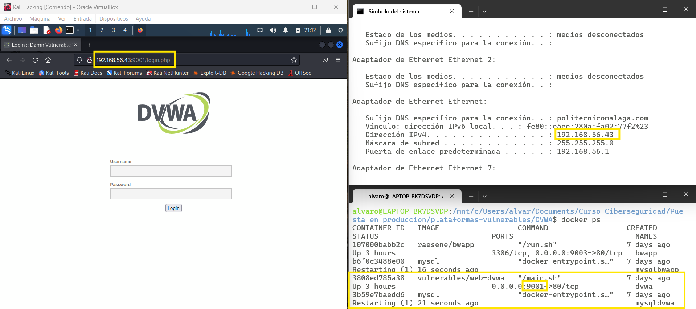
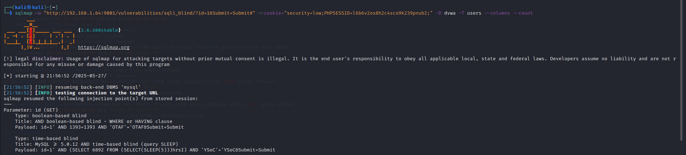
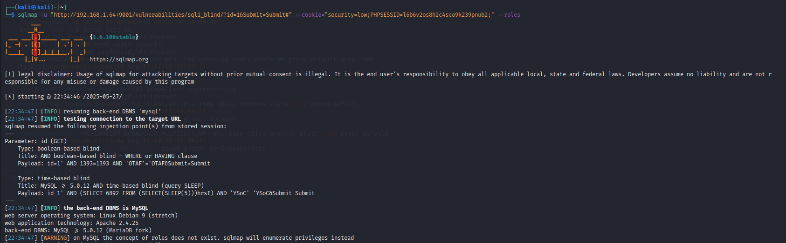
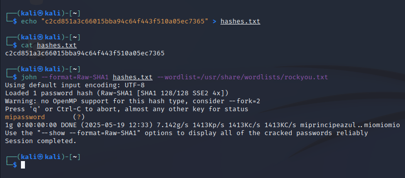
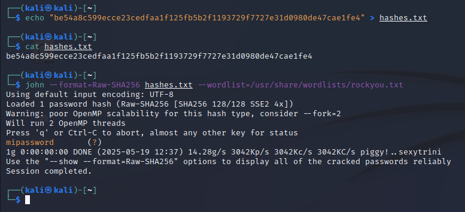
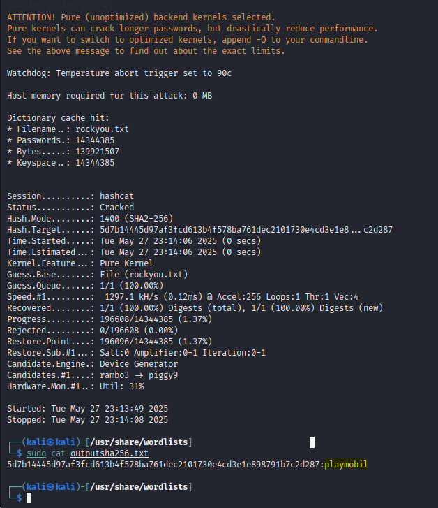
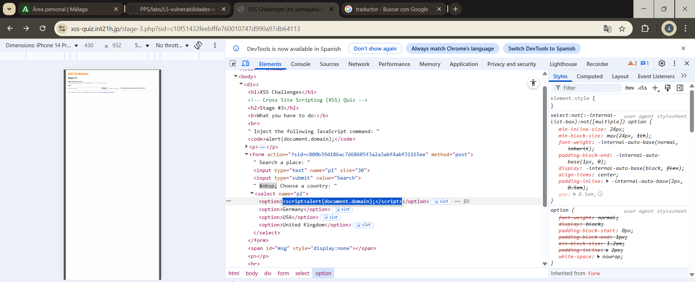
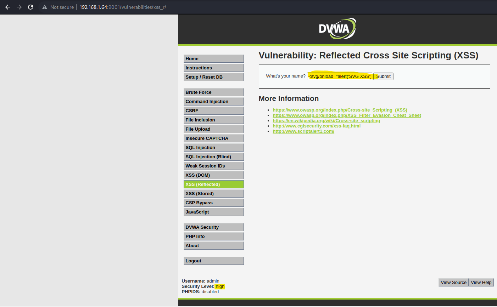
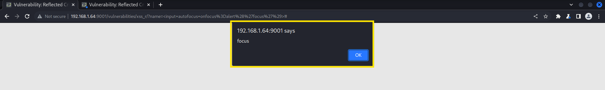
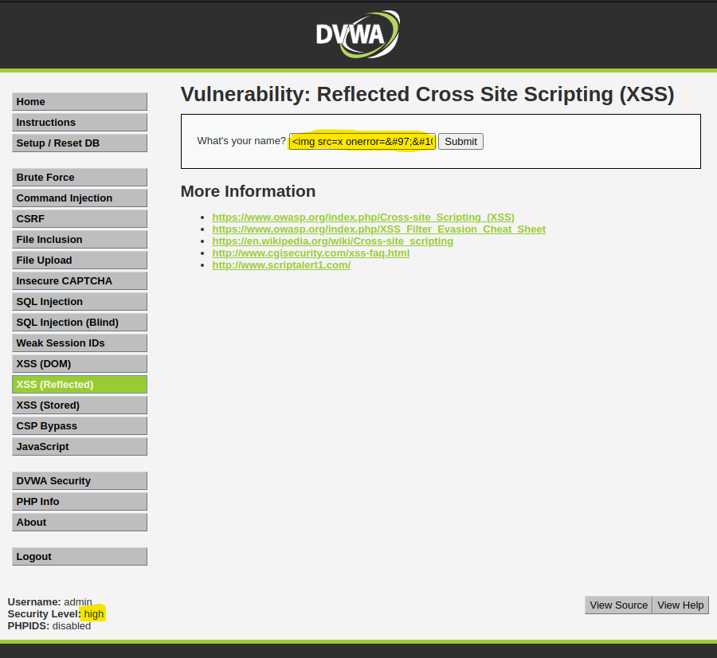

# Laboratorio 5: Vulnerabilidades Web

# Índice

- [PRÁCTICA 5.0. Reverse shell en Mutillidae II](#id0)

- [PRÁCTICA 5.1. SQL Injection (3 puntos)](#id1)
    - [PRÁCTICA 5.1.1 SQLMap Práctico (1 puntos)](#id2)
    - [PRÁCTICA 5.1.2 SQLMap Teórico (1 punto)](#id3)
    - [PRÁCTICA 5.1.3. SQLMap Avanzado (1 punto)](#id4)

- [PRÁCTICA 5.2. Ataques offline y online (4 puntos)](#id5)
    - [PRÁCTICA 5.2.1. Ataques prácticos (2 puntos)](#id6)
        - [PRÁCTICA 5.2.1.1 Ataque offline con John the Ripper (1 punto)](#id7)
        - [PRÁCTICA 5.2.1.2 Ataque online con Burp Suite e Intruder (1 punto)](#id8)
    - [PRÁCTICA 5.2.2. Ataques teoría (1 punto)](#id9)
    - [PRÁCTICA 5.2.3. Ataques offline y online Avanzado (1 punto)](#id10)

- [PRÁCTICA 5.3. XSS (3 puntos)](#id11)
    - [PRÁCTICA 5.3.1. XSS prácticos (1 punto)](#id12)
    - [PRÁCTICO 5.3.2. XSS teoría (1 punto)](#id13)
    - [PRÁCTICO 5.3.3. XSS avanzado (1 punto)](#id14)


# PRÁCTICA 5.0. Reverse shell en Mutillidae II  <a name="id0"></a>

### Vamos a probar a incluir una reverse shell en Mutillidae II


* Lo primero es tener montado y arrancado Multillidae II que este caso esta levantado con el docker compose que se nos ha proporcionado en clase

### 1.  Descargamos el repositorio desde GitHub


* Clonamos el repositorio de github que se proporciona en la guia del tema

### 2. Cambiar la extensión de la shell


* Segun nos explica la guia , tenemos que cambiar la extension de la shell de .php a .txt para hacer que la shell la interprete el servidor web al que queremos atacar y no nuestra propia maquina

### 3. Modificar la IP y puerto dentro del código de la shell


* Segun nos explica la guia , tenemos que cambiar la extension de la shell de .php a .txt para hacer que la shell la interprete el servidor web al que queremos atacar y no nuestra propia maquina

### 4. Levantamos un servidor web en Kali Linux


* Ahora levantamos un servidor de apache en nuestra kali y copiamos nuestro .txt de shell inversa en la ruta /var/www/html/

### 5. Dejamos Netcat a la escucha 


* Ahora en otra terminal a parte dejamos netcat a la escucha en el puerto en el que hemos asignado el script en este caso 1234


### 6. Realizamos la inclusión remota


* Lo que nos comenta la guia es que la clave para realizar la script reversa es que Mutillidae te permite ejecutar comandos en el server desde la url como se ve en el ejemplo que muestra el archivo /etc/passwd 


* Por ello para realizar la inclusion hago dentro de la url una peticion http al server de mi kali en la direccion de mi archivo.txt para ejecutarlo dentro del server de mutillidae


* Y si nos vamos a la terminal que estaba escuchando ese mismo puerto podemos observar que tenemos la shell inversa operativa para usarse

# PRÁCTICA 5.1. SQL Injection (3 puntos)  <a name="id1"></a>

## PRÁCTICA 5.1.1 SQLMap Práctico (1 puntos)  <a name="id2"></a>

#### A) Instalación y Configuración de DVWA


* Para tener DVWA he utilizado el Docker compose proporcionado en clase 



* Para acceder a DVWA , una vez esta levantado el docker compose como se ve en la parte unferior derecha de la imagen anterior, desde el navegador de la kali accedemos a la ip de la maquina donde esta desplegada DVWA (la ip marcada en la imagen de la cmd de la parte superior derecha) con el puerto que hemos asignado en el compose que apunte al 80 del contenedor (en este caso el puerto 9001) 


* Finalmente para acceder a DVWA accedo con el usuario que se proporciona en el laboratorio (usuario: admin, contraseña: password)

#### B) Configuración del Proxy con Burp Suite


* Accedo a Burp Suite mediante Kali y asigno los parametros por defecto


* Dentro del apartado Proxy>Options se encuentra la configuracion de Proxy la cual ya esta configurada porque lo configure para realizar algunas actividades de hacking


#### C) Captura de Tráfico:


* Accede a DVWA desde el navegador de burpsuite


* Le doy al boton intercept on para habilitar a burp de capturar el trabfico


* Intento iniciar sesion y cuando le doy al boton login me salta la pastaña de burpsuite donde muestra lo que ha captado


* Como podemos observar tenemos hemos capturado coas importantes como son PHPSESSID y el parametro security

#### D) Extracción de Cookies y Token de Sesión


Como hemos visto en la captura anterior estas son mis cookies : 

    -PHPSESSID : qsv17g4eguib1dipbqlpatd0c3;
    -cookie de sesion: 333c86d2638b6c5eddda30aa8613fb45

#### E) Ejecución del Ataque con SQLMap

1. Enumeración de Bases de Datos: Debes Listar las bases de datos, entre las cuales se debería encontrar la base de datos dvwa.


* Para conseguir enumerar las bases de datos usamos el comando que se facilita en la guia solo que tenemos que modificarlo con la ip que tiene nuestro servidor que vamos a atacar y por el puerto que vamos a atacarle, en nuestro caso el 9001. Ademas tenemos que cambiar las cookies de PHPSESSID a las que hemos extraido en el apartado anterior

2. Enumeración de Tablas de la Base de Datos: Con la base de datos identificada, ahora debemos listar las tablas de la misma. Verás una lista de tablas, identificándose la tabla `users` entre otras.


* Para conseguir enumerar las tablas de la base de datos , usamos el comando anterior solo que al final añadimo la opcion -D dvwa que es para indicar a que base de datos queremos extraer informacion y usamos la opcion --tables para que me muestre las tablas

3. Enumeración de Columnas de una Tabla Específica: Una vez localizada la tabla `users`, extraemos las columnas disponibles, entre las cuales se deberían identificar campos como `user` y `password`.


* Para obtenemer informacion de las columnas de una tabla en concreto usamos el mismo comando que antes usamos la opcion -D de nuevo para indicar la base de datos y la opcion -T para para indicar de que tabla queremos las columas, en concreto vamos ausar la de users y finalmente ponemos la opcion --columns para extraer la informacion de las columnas


4. Volcado de Datos de la Tabla Objetivo: Finalmente, extrae los datos específicos (usuarios y contraseñas) de la tabla `users`: obteniendo la información de los usuarios y contraseñas (estas últimas estarán cifradas).


* Para hacer el volcado de los datos final usamos el mismo comando anterior indicando la base de datos y la tabla de la que queremos extraer informacion solo que una vez que sabemos las columnas que tiene la tabla objetivo usamos la opcion -C para indicar que columnas queremos obtener la informacion en nuestro caso de la columna user y password y finalmente usamos la opcion --dump para hacer el volcado de los datos de esas columnas

#### F) Refinamiento de SQLMap

 1. Modificación de Flags en SQLMap: Ejecución de comandos con los flags --level y --risk diferentes para observar cómo varía la cantidad y profundidad de la información extraída. Explica para qué sirven estos flags.


* En principio la opcion --level es para indicarle a sqlmap como de "agresivo" es a la hora de intentar extraer informacion a nivel de cosas que prueba para obtener la informacion, pero he probado con los diferentes tipos de comandos usados anteriormente y no veo ninguna diferencia


* Y al igual que la opcion level la opcion --risk se supone que sirve para indicarle a sqlmap como de agresivos son los payloads que se van a usar para extraer la informacion pero he probado con los comandos anteriores y tampoco noto que haya una diferencia con ejecutarlo normal
<br>

2. Simulación de Errores: Intenta modificar valores de cookies o parámetros URL para simular errores. Documenta qué tipo de mensajes de error son retornados y cómo se podrían interpretar para mejorar la seguridad.


* El primer cambio que he echo ha sido usar un valor que me he inventado en las cookies el cual me devuelve un error critico el cual te avisa de que parece que no hay ningun parametro en el que se pueda hacer inject


* El primer cambio que he echo ha sido usar un valor que me he inventado en las cookies el cual me devuelve un error critico el cual te avisa de que parece que no hay ningun parametro en el que se pueda hacer inject


* Despues he probado a cambiar la cookie de security poniendolo en high y sqlmap me devuelve lo mismo que en cambio anterior, un error critico de que no hay parametros inyectables


* Despues otro error que he forzado es que no le he añadido el puerto por el que nos comunicamos con el servidor al que queremos atacar por lo que se queda busacando la url termina dando el error citico de que se ha acabo el tiempo de conexion

## PRÁCTICA 5.1.2 SQLMap Teórico (1 punto)  <a name="id3"></a>

A continuación se proponen diversas preguntas que combinan aspectos teóricos y prácticos, con un énfasis especial en la parte práctica del ejercicio:

1. ¿Qué es una inyección SQL ciega y en qué se diferencia de una inyección SQL clásica?

<b>La diferencia entre la inyeccion sql ciaga a la clasica se basa en que la respuesta que te da el servidor con una consulta de sql ciega va a ser true o false por tanto tienes que hacer sentencias diferentes a las clasicas para conseguir mediante true o false obtener la información</b>
<br>

2. Explica el propósito de utilizar Burp Suite en este ejercicio. ¿Qué información crítica se obtiene mediante este proxy?

<b>En este ejercicio el objetivo de Burp suite es capturar la peticion que le enviamos al servidor en el momento de hacer log in en DVWA con la intencion de obtener informacion sensible como en este caso las cookies</b>
<br>

3. ¿Por qué es indispensable disponer de una sesión activa al atacar una aplicación como DVWA?

<b>Es indispensable de tener una sesion activa para atacar DVWA ya que nosotros estamos realizando los ataques desde los formularios que se encuentran dentro de la pagina y si tenemos una sesion activa nos redirigira constantemente al login </b>
<br>

4. Describe el rol del token de sesión y de la cookie PHPSESSID en el contexto del ataque. ¿Cómo afectan estas a la autenticación y a la ejecución de la inyección?

<b>El token de sesión y la cookie de PHPSESSID basicamente son los elementos que permite que el server te de acceso a la hora de realizar el ataque ya que si no estas autenticado no te permite el acceso a la web ya que para hacer los ataques dentro de DVWA tienes que estar logueado</b>
<br>

5. Detalla los pasos para configurar el proxy en el navegador y explicar cómo se intercepta el tráfico de DVWA.

<b>Para configurar el proxy en el navegador tendriamos que asignar en el foxyproxy  por localhost y el puerto que tiene asignado el burp suite , a mi me gusta mas usar el navegador dentro del propio burp suite donde realmente se hace lo mismo, en el momento que tu quieres interceptar una peticion que se le quiere hacer al servidor , en caso de foxyproxy se activa en el firefox y la siguiente peticion que se haga se captura en el burp suite. Y en el navegador de burpsuite es igual solo que cuando queires interceptar una peticion le das al boton de intercept on y la siguiente peticion se captura</b>
<br>

6. Describe el proceso de captura de una petición mediante Burp Suite. ¿Qué elementos de la cabecera HTTP son fundamentales para la ejecución del ataque con SQLMap?

<b>Yo lo que hago es acceder al navegador de burp suite y cuando quiero capturar alguna peticion le doy al boton de intercept on, y la siguiente interaccion que hago con el servidor lo captura burp suite . Y para realizar la ejecucion del comando es necesario la url y las cookies que hemos obtenido en la captura del burp suite</b>
<br>

7. ¿Qué significa el flag --dbs y cuál es el objetivo de listar las bases de datos del servidor?

<b>La flag --dbs sirva para listar las bases de datos que se encuentran en un servidor al que queremos atacar , el objetivo de listar las bases de datos suelen ser que segun los nombres pueden darnos pistas de lo importantes que sean en el servidor y ya una vez sepamos los nombres con el rsto de flags vistos anteriormente podemos obtener la informacion de sus tablas ,columnas,ect...</b>
<br>

8. Explica la diferencia entre los flags -D, -T y --columns en SQLMap y cómo se relacionan en el flujo de extracción de información.

<b>La flag -D es para indicarle a sqlmap que base de datos queremos obtener la información. la flag -T es para indicar de que tabla queremos obtener la información y la flag --columns sirve para obtener las columnas de la base de datos y tabla que le hemos indicado en las flags anteriores. por tanto para el flujo de extracción  primero tienes que obtener las bases de datos que hay, despues las tablas que hay en la base de datos que quieres extraer informacion y finalmente puede usar la flag --columns para ver las columnas de la tabla que quieres obtener información</b>
<br>

9. ¿Qué hace la flag --dump y cómo se relaciona con el objetivo final del ejercicio (obtener usuarios y contraseñas)?

<b>La flag --dump es util ya que una vez hemos obtenido toda la informacion sobre la base de datos, tablas y columnas de las que queremos obtener la informacion nos da la opcion de realizar un volcado de los datos que hay en las columnas que le asignemos  </b>
<br>

## PRÁCTICA 5.1.3. SQLMap Avanzado (1 punto)  <a name="id4"></a>

#### Desarrolla una mini guía de opciones avanzadas de uso de SQLMap, es importante que razones qué estás haciendo y por qué. Documentate de fuentes externas: Blogs, VideoTutoriales, IAs, pero es imprescindibles que generes tu propia base de datos de referencias, es decir, de dónde has extraído la información (y comprueba la veracidad).

#### Debes realizar una demo práctica de opciones avanzadas, para ello aparte de la mini guía, puedes grabar un pequeño vídeo o capturas de pantalla mostrando las opciones avanzadas y sus usos.





* La primera opcion que a priori parece que no es de mucha utilidad pero realmente puede ser una informacion importante dependiendo de la situacion es la opcion --count que te permite realizar el recuento de elementos, en este caso se realiza sobre columnas 


* La siguiente opcion interesante que he encontrado es la opcion --sql-shell que nos da la opcion de abrir una shell de aql para realizar consultas las cuales nos pueden ser de mucha utilidad, en este caso muestro que se puede extraer la version de MariaDB lo cual es una informacion muy valiosa ya que a partir de esto se pueden buscar vulneravilidades de la versión 


* Otra opcion que me parece interesante es la opcion --dump-all ya que te permite volcar en este caso todo lo que se puede extraer de la base de datos dvwa


* Otra opcion que me parece util es la opcion --current-user la cual nos muestra que usuario esta manejando la base de datos 


* Otra opcion que me parece util es la opcion --current-db la cual nos muestra que base de datos esta en uso actualmente





* Otra opcion que me parece util es la opcion --roles  la cual nos muestra que roles tienen los usuarios que tienen una base de datos, esto es util por si queremos escalar privilegios alomejor nos damos cuenta que un usuario con altos privilegios  que usa la base de datos podemos "usarlo" para la escalada

Las fuentes que he usado basicamente son la room de Tryhackme la cual te habla sobre el comando SQLMap [Room de TryHackMe](https://tryhackme.com/room/sqlmap), la propia ayuda del comando para ver todas las opciones sumadas a la IA para filtrar cuales de las opciones eran mas interesantes


# PRÁCTICA 5.2. Ataques offline y online (4 puntos)  <a name="id5"></a>

## PRÁCTICA 5.2.1. Ataques prácticos (2 puntos)  <a name="id6"></a>

### PRÁCTICA 5.2.1.1 Ataque offline con John the Ripper (1 punto)  <a name="id7"></a>

1. Generear hashes 


* Primero vamos a generar un hash md5 usando ssl
* hash: 1ab5bf2311c3c4909221ac089eaf3564


* Despues generamos el hash sha1 y sha256
* hash sha1: c2cd851a3c66015bba94c64f443f510a05ec7365
* hash sha256: be54a8c599ecce23cedfaa1f125fb5b2f1193729f7727e31d0980de47cae1fe4


* Ahora hemos usado bcrypt para generar un hash
* hash: $2b$05$615m8rsTQxOKrOv1U.7.1.Z84w6NTOVMVfIg1KNO1AN94xm3oflf2


* Ahora hemos usado htpasswd para obtener un hash tipo apache (MD5 base64)
* salida: usuario:$apr1$FbD4.EfQ$DjbryTaMJFS01CpxiD/V/1

2. Vulnerabilidad de passwords con John the Ripper


* He creado el archivo hashes.txt para descifrar con John the Ripper el hash md5 y como podemos observar lo obtiene sin problemas y el tiempo tarda menos de un segundo



* Ahora he cambiado el archivo hashes.txt y he añadido el hash en formato SHA1 para descifrarlo, john lo descifra sin problemas en menos de un segundo



* Ahora he cambiado el archivo hashes.txt y he añadido el hash en formato SHA256 para descifrarlo, john lo descifra sin problemas en menos de un segundo


* Ahora he cambiado el archivo hashes.txt y he añadido el hash en formato bcrypt para descifrarlo, john en este caso tarda mas en descifrarlo , a mi me ha tardado 1 minuto y 13 segundos


* Ahora he cambiado el archivo hashes.txt y he añadido el hash en formato Apache md5 para descifrarlo, john Tarda poco pero no es instantaneo, a mi me ha tardado 2 segundos

| Algoritmo   | Comando para crear       | ¿John lo soporta? | Tiempo que tarda John en descifrarlos              |
|-------------|--------------------------|-------------------|-----------------------------|
| MD5         | `openssl dgst -md5`      | ✅                | Menos de 1 segundo               |
| SHA1        | `openssl dgst -sha1`     | ✅                | Menos de 1 segundo                        |
| SHA256        | `openssl dgst -sha256`     | ✅                | Menos de 1 segundo                        |
| bcrypt      | `mkpasswd -m bcrypt`     | ✅                | Ha tardado 1:13 para descifrarlo                      |
| Apache MD5  | `htpasswd -nbm`          | ✅                | Ha tardado 2 segundos para descifrarlo    |


### PRÁCTICA 5.2.1.2 Ataque online con Burp Suite e Intruder (1 punto)  <a name="id8"></a>

1. Diccionario desde marca.com


* cewl escanea la pagina que le indicamos y añade palabras en un txt , yo he dejado un rato el comando para que añada palabras pero cuanto mas tiempo lo dejes mas palabras extrae

2. Diccionario desde bab.la/admin


* Esta opcion es util por si queremos realizar un diccionario personalizado de una ruta concreta de una pagina web como en esta caso que obtiene informacion de una ruta /admin que normalmente deberia tener informacion importante

3. Captura de petición de login con Burp Suite

i. Configura tu navegador para que todo el tráfico pase por Burp Suite (Proxy).<br>

ii. Dirígete al formulario de login de la aplicación objetivo.<br>

iii. Introduce cualquier valor en el login (por ejemplo, admin:1234) y captura la petición HTTP.<br>

iv. Envía la petición capturada a la pestaña Intruder.<br>

v. En la pestaña Positions, elimina todos los marcadores automáticos y selecciona solo el campo de contraseña como campo dinámico (payload).<br>

* El campo de usuario debe permanecer fijo (admin).<br>

* Usa la opción Clear § y luego selecciona manualmente solo el valor de la contraseña y presiona Add §.<br>


#### Como no te avisaba en el enunciado que aplicación objetivo usar lo hice con el formulario de brute force de DVWA 


* Accedo a la aplicación objetivo que ya que estamos voy a usar DVWA el apartado de fuerza bruta desde el navegador de burp suite para poder capturar el trafico cuando quiera punsando en el boton de intercept. Dejamos preparado el usuario y contraseña  


* Le doy al boton intercerpt on para que me capture la siguiente peticion que haga 


* Intente logearme usando admin admin y al darle al boton de log in burp suite me captura la peticion que le he hecho a la pagina


* Ya tenemos la peticion capturada ahora vamos a enviarla al intruder 


* Para enviarlo al intruder pinchamos en action y le damos a send to intruder


* Dentro de intruder le damos al boton clear porque cuando envias la peticion a intruder te suele poner marcadores automaticos a campos que se suelen extraer , pero nosotros solo queremos intentar sacar la contraseña 


* Para añadir que solo nos extraiga la contraseña seleccionamos lo que le enviamos en el campo password de la peticion y le damos al boton add 


4. Ejecución del ataque con diccionario personalizado

i. En la pestaña Payloads, selecciona el diccionario marca.txt o babla.txt como fuente.<br>

ii. Ejecuta el ataque con el botón Start attack.<br>

iii. Observa las respuestas del servidor para cada intento.<br>


* En la seccion de payload dentro de intruder le damos a load en payload options para cargar el diccionario que hemos creado anteriormente (en este caso el de marca) 


* Como podemos observar se ha cargado el diccionario y el siguiente paso seria darle al boton de start attack


* Al pinchar en start attack nos abre una pestaña donde burp suite prueba todas las palabras del diccionario que le hemos administrado , en esta ocasion el diccionario que he usado no me aporta ninguna credencial valida

5. Detección de credencial válida

Como en el intento anterior no he conseguido una credencial valida voy a crear otro diccionario para intentar obtener una credencial valida a priori.


* He realizado un diccionario a partir del administrador de contraseñas de google, vamos a probar si funciona


* Lo cargo en el payload y vuelvo a ejecutar el ataque


* En esta ocasion al acceder a la comprobacion del diccionario podemos observar que una da las peticiones que devuelve de probar con una palabra del diccionario es mas larga que el resto, esto es indicio de que es una credencial valida


* Al intentar acceder con la palabra que devuelve una peticion de tamaño mayor (password) consigo acceder a la aplicación

## PRÁCTICA 5.2.2. Ataques teoría (1 punto)  <a name="id9"></a>

Responde brevemente las siguientes preguntas. Justifica cuando se indique. Busque información complementaria del vocabulario o términos que desconozca.

1. ¿Cuál es la diferencia entre un ataque offline y un ataque online a credenciales?

<b>Un ataque offline es cuando tu por ejemplo obtienes el hash de una contraseña que quieres extraer , que ya lo tienes en tu oredenador y tienes todo el tiempo que necesites para obtener la contraseña sin problemas , en cambio los ataques online de credenciales estas constantemente probando con el servidor al que se quiere atacar el cual te puede poner impedimentos para conseguir tu objetivos como tener un firewall , banear tu ip, caparte las peticiones que le puedes hacer , etc...</b>
<br>

2. ¿Qué ventaja ofrece el uso del diccionario rockyou en pruebas de fuerza bruta?

<b>Es util porque es un diccionario muy extenso de palabras que normalmente son contraseñas pero realmente si quieres realizar un ataque de fuerza bruta lo ideal seria crear uno personalizado con las contraseñas o formato de contraseñas que tiene el server/empresa/etc.. a atacar para que sea exitoso </b>
<br>

3. ¿Qué información nos proporciona hash-identifier y por qué es relevante antes de usar John the Ripper?

<b>El comando hash-identifier sirve para saber que tipo de formato es el hash que quieres analizar y es util para john the ripper porque en algunar casos necesitas proporcionarle el formato del hash a john porque no es capaz de identificarlo</b>
<br>

4. ¿Por qué un código de estado HTTP 302 Found puede indicar un inicio de sesión exitoso en un ataque de diccionario?

<b>Porque si todos los intentos que son fallidos te devuelven un error 200 (significa OK) y casualmente uno de devuelve un error 302 (que el servidor te redirecciona la peticion) puede indicar que te va a redireccionar a que el login a tenido exito</b>
<br>

5. ¿Qué precauciones éticas y legales deben tenerse en cuenta al realizar este tipo de prácticas en entornos reales?

<b>Yo pienso que las preocupaciones eticas y legales que tenemos que tener en cuenta es directamente es no realizar este tipo de ataques en un entorno real, nosotros hacemos estos tipos de ataques para saber las tecnicas y metodos que usan los atacantes a los cuales en un futuro debemos intentar evitar que por ello debemos saber la existencia de estos </b>
<br>

6. Explora cómo cambiaría tu estrategia si las contraseñas estuvieran “salteadas” (salted). ¿Qué dificultades añade el uso de salt y cómo podrías adaptarte?

<b>

Realmente el uso de salt en contraseñas lo que provoca es que sea mas dificil y que se tarde mas en obtener la contraseña porque por cada intento tienes que descifrar el hash y el salt 

</b>
<br>

7. ¿Cómo impactaría el uso de GPUs o clusters de computación en la velocidad de un ataque offline con John the Ripper? Describe al menos dos formas de escalar tu ataque.

<b>Pues una de las formas que permite de escalar mi ataque por ejemplo las GPUs te permiten ejecutar mas operaciones a la vez en menos tiempo, por tanto se pueden hacer mas intentos de averiguar la contraseña en mi ataque 

Y otra forma de escalar mi ataque seria usando cluster de computacion que con ellos se pueden repartir entre ellos los intentos que se prueban y por tanto permite realizar mas intentos distribuidos entre clusters a la vez

Como conclusion el uso de GPU o cluster incrementaria la eficacion y velocidad de los ataques</b>
<br>

8. ¿Qué ventajas y desventajas tiene un ataque híbrido (combinando reglas de mangling con diccionarios) frente a uno puramente de diccionario o puramente de fuerza bruta? Proporciona ejemplos de reglas útiles.

<b>La ventajas de un ataque hibridos frente a uno de diccionario o fuerza btutas son que de contraseñas comunes permite realizar variaciones de esta y por tanto es mas eficiente a la hora de extraer contraseñas con pequeñas variaciones, tambien son mas rapidos que los ataques de fuerza bruta

Sin embargo uno de los problemas que tienes son que no usa tantas combinaciones diversas como tal sino que de las palabras que tiene realiza las modificaciones que se comentan en las ventajas y debido a esto otra de de las desventajas es que si queremos tener exito es muy importante lo bien creado que este el formulario que se vaya a usar</b>
<br>

9. Imagina que el formulario de login de Mutillidae II aplicara un límite de tres intentos antes de bloquear la IP. ¿Cómo sortearías esa restricción para continuar tu ataque online?

<b>Lo primero que se me ocurre seria realizar un ataque que en el momento de que se realize las tres peticiones al servidor se cambie la ip de mi maquina atacante y ir probando de nuevo, asi sucesivamente hasta obtener mi objetivo</b>
<br>

10. Describe cómo detectarías y diferenciarías en tus logs un ataque de diccionario con Burp Suite de un acceso legítimo de un usuario.

<b>Lo mas destacable que creo que diferencia estos tipos de logs con un acceso legitimo de un usuario es que alomejor un ataque de diccionario te puede generar un moton de logs en menos de un segundo , lo cual un usuario normal suele tardar un poco entre intento e intento</b>
<br>

11. Más allá de capturar la contraseña, ¿qué información extra podrías inferir de la respuesta HTTP (cabeceras, tiempos de respuesta, tamaño de contenido) para enriquecer tu ataque?

<b>Lo mas importante que creo que se podria extraer de este tipo de respuestas serian cookies, que en objetivos que no tienen mucha seguridad incluso se podria obtener las cookies de sesion para suplantar la identidad de usuario y hacer acciones maliciosas con su identidad</b>
<br>


## PRÁCTICA 5.2.3. Ataques offline y online Avanzado (1 punto)  <a name="id10"></a>

## Desarrolla una guía avanzada de ataques de contraseñas online y offline, enfocándote en las técnicas y herramientas más efectivas en contextos reales. El objetivo no es solo aplicar comandos, sino razonar, justificar y documentar qué haces y por qué.

### La primera Guia que voy a realizar es de hashcat


* Para comenzar he preparado una serie de hashes para realizar la prueba


 Para usar el comando hashcat hay unas opciones que son necesarias saberlas, -m que sirve para asignarle al comando en el formato que se le va a enviar el hash , en el caso de md5 se le pone 0. 

Despues tenemos la opcion -a donde le asignamos el tipo de ataque que se quiere usar , en este caso el 0 indica que vamos a realizar un ataque de diccionario , se pueden llegar a asignar para realizar ataques combinados,hibridos,etc... 

La opcion -o para decir donde guardar el resultado del comando (como un txt) y finalmente se le asigna el archivo donde se encuentra el hash y el diccionario que se va a usar. En nuestro caso rockyou.txt

Como podemos observar Al lanzar el comando nos muestra bastante informacion sobre lo que ha realizado el comando y cuando finaliza encontramos el archivo donde guardamos la solucion que si miramos en su interior vemos la contraseña de la que se creo el hash


 Esta captura la muestro ya que es muy importante indicarle al comando el tipo de hash que va a intentar descifrar ya que le he dicho que intente extraer el hash de un sha1 pero le he dicho que va a recibir un formato md5 por tanto falla el comando


* Para asignarle el formato sha1 se le añade el numero 100, al finalizar obtenemos la contraseña 




* Y finalmente para asignarle el formato sha256 se le añade el numero 1400s, al finalizar obtenemos la contraseña 


Para realizar esta guia primero he usado un prompt para ver como se usa hashcat de forma sencilla (me puedes hacer una pequeña muestra de como usar hashcat?) y luego a partir de esa muestra he usado el siguiente manual para ver que asignal en las opciones del comando [PDF de hashcat](https://hashcat.net/files/hashcat_user_manual.pdf)

# PRÁCTICA 5.3. XSS (3 puntos)  <a name="id11"></a>

## PRÁCTICA 5.3.1. XSS prácticos (1 punto)  <a name="id12"></a>


* Para realizar la practica accedemos a la url que nos ofrece la guia para realizar los retos de XSS


* Inspeccionamos la pagina para observar que podemos hacer y como podemos ver esta etiqueta input lo que va ha hacer es tener el valor de lo que el usuario introduzca por el input


* Por tanto con meter el alert en(document.domain); en una etiqueta script se ejecutara el alert sin problema


* Al pinchar en search nos aparece el alert que hemos añadido en el input 


* Y nos da el reto como completado, en este caso como prevencion para esto no ocurra pienso que se deberia comprobar que en el input no se pueda usar la etiqueta script evitando este ataque

### PRÁCTICA 5.3.1. Stage 2 Cerrando etiquetas existentes


* Para el stage 2 la pista que nos dan es que cierre el tag actual y añada el tag de script anterior


* En este caso si ejecutamos la etiqueta script tal cual el stage anterior no funciona ya que interpreta lo que hemos introducido como texto normal


* En cambio si antes de la etiqueta script añadimos "> provocamos que se cierre el value como vacio para asi introducir la etiqueta script de forma que se ejecute y no se interprete como texto normal 


* Y al pinchar en search conseguimos realizar el ataque XSS y para este stage pienso que para evitarlo hay que controlar los caracteres que pueda insertar el usuario como "",<>,etc...


### PRÁCTICA 5.3.1. Stage 3 Inyectado en desplegables


* Para el stage 3 la pista que nos dan es que de alguna forma tenemos que evitar el escapar del text box


* Al usar el script tal cual lo vuelve a interpretar como texto. Por tanto vamos a inspeccionar la pagina


* Al inspeccionar nos damos cuenta de que el valor de las opciones estan escritas tal cual 



* Si modificamos una de las opciones desde inspeccionar y añadimos la etiqueta script con el alert dentro de una cualquiera de las options


* Despues aparece en el desplegable de choose a country, vamos a probar a darle a search


* Al pulsar se ejecuta el alert sin problema completando el nivel. Para este caso la forma que creo que podria evitar el ataque seria que antes de realizar la busqueda, se compruebe que el valor que se ha puesto en el desplegable sea una de las opciones que habia anteriormente. Evitando asi ejecutar options modificadas por los atacantes

### PRÁCTICA 5.3.1. Stage 4  Campos ocultos


* La pista que te da en el stage 4 es campo de input invisible


* En este caso he probado a usar los ataques anteriores y no he tenido exito, por tanto inspecciono la pagina y veo un input hidden con el valor hackme y ademas la pista nos habla de un input invisible, por tanto vamos a intentar acceder desde este input


* Me he tenido que mover a firefox ya que por alguna razon no me dejaba modificar el input desde chrome , pero si nos damos cuenta este stage es similar que el segundo donde el objetivo evitar el escapado del input, pero en este caso desde el inspector, debido a esto no podemos hacer como en el stage 2 de poner la comillas directamente ya que no funcionara, entonces la forma que vamos a usar para introducir las comillas desde el inspector va a ser a partir de si numero asccii. Para ello se comienza con &# y el numero de las comillas que es el 34 , lo demas es igual que antes, introducimos el alert con la etiqueta script


* Y finalmente una vez cerramos el inspector con los cambios realizados y le damos a buscar se ejecuta el alert exitosamente. 


### PRÁCTICA 5.3.1. Stage 5  Longitud Máxima


* La pista que nos da el stage 5 es el limite de tamaño en el text box


* Como podemos observar en el inspector , se encuentra en campo maxlength a 15 el cual es el que "evita" la inyeccion de codigo


* El problema que tiene el campo maxlength es que si modificamos el valor a uno mayor , te da la posibilidad de realizar un ataque XSS evitando el escapado del input como hicimos en el stage 2 


* Una vez modificado el maxlegth y cerrado el inspector añadimos el mismo texto que usamos para escapar el input en el stage 2


* Y como podemos observar conseguimos ejecutar el alert sin problema. Para evitar este ataque lo que haria seria usar todos los filtros que vaya a usar en los input en la parte del servidor porque si se pone en el cliente le das la opcion a modificar los valores desde el inspector como hemos observado

### PRÁCTICA 5.3.1. Stage 6  Inyectando eventos


* La pista que nos da el stage 6 es atributo de manejador de eventos


* A priori si vemos el inspector parece que podriamos realizar el mismo ataque de escapar el input y añadiendo las etiquetas scripts 


* Pero al probar con este nos damos cuenta que los caracteres < y > se depurar para evitar ejecutar/usar las etiquetas en el texto. Por tanto vamos a seguir el camino que nos da la pista de añadir un evento 


* Realmente vamos a introducir un campo escapando el input como en el stage 2 solo que para este vamos a introducir el alert en un evento onfocus, este evento se activa cuando se pone el raton encima del elemento


* En este caso cuando le damos search en la captura del paso anterior parece que no ha tenido efecto, pero como he comantado antes hemos añadido el evento pero ahora falta activarlo, entonces para ello ponemos el raton encima del input y nos aparece el alert


* Y como podemos observar completamos el nivel con exito, en este caso para evitar este ataque lo que se me ocurre es que al igual que los caracteres < y > depuerar los caracteres de las comillas, el igual ,etc.. 

## PRÁCTICO 5.3.2. XSS teoría (1 punto)  <a name="id13"></a>

1. ¿Cuál es la diferencia entre XSS almacenado, reflejado y DOM-Based? Explica cada uno con un ejemplo práctico.

<b>El XSS almacenado lo que produce es que la inyeccion realizada se queda almacenada en la web/aplicaion provocando que los usuarios nuevos que consulten la web/aplicacion lo ejecuten sin saberlo como por ejemplo que se quede el script malicioso en un comentario de la pagina que cada vez que se cargue se ejecute 

El XSS reflejado es un tipo ataque que a la hora de inyectar el codigo no se almecena en el servidor sino que solo se ejecuta en la victima a que se le envia como por ejemplo si te envian un email que tiene una url oculta

El XSS basado en el DOM es un ataque que su objetivo principal es inyectar el codigo a traves del javascript que usa el navegador para evitar la seguridad del servidor. Como por ejemplo inyectando codigo en propiedades del navegador como location.search que forma parte del DOM

</b>
<br>

2. ¿Qué papel juega el `Content-Type` y el `Content-Security-Policy` (CSP) en la prevención de ataques XSS? ¿Son suficientes por sí solos?

El Content-Type es una propiedad que se usa en las cabeceras para indicarle al cliente que tipo de contenido se va a retornar y en solicitudes (POST o PUT) el cliente le indica al servidor el tipo de dato es enviado.

<b>
El Content-Security-Policy es una configuracion que se añade en las cabeceras donde se puede añadir diferentes valores para controlar recursos que puede cargar el usuario. Algunos de los valores que se pueden añadir a estas configuraciones son que todas las cosas que se carguen en el sitio provengan de propio sitio , se puede poner valores para que se puedan cargar contenido de otros dominios y subdominios que el administrador del sitio considere seguros</b>

<br>

3. Un atacante introduce el siguiente payload en una entrada de comentario:

```html
<script>alert(document.cookie)</script>
```
¿Por qué este vector es tan común, y cómo podría un servidor mal configurado permitirlo?

<b>Yo creo que este vector de ataque suele ser comun porque es la manera mas facil y rapida de comprobar que un servidor esta mal configurado ya que es como lo principal que se deberia securizar. Pero los servidores que estan mal configurados permiten estos tipos de payload porque no escapan correctamente las etiquetas de script</b>
<br>

4. ¿Qué técnicas puede usar un atacante para evadir filtros comunes de XSS, como el filtrado de etiquetas `<script>`? Nombra al menos 3.

<b>Uno que hemos usado es añadir el codigo malicioso a traves de eventos de etiquetas de html como onfocus , onerror , etc...

La segunda forma podria ser codificando los caracteres como hemos realizado en ejercicios anteriores para que evite los filtros 

El tercero es escapar los elementos usando comillas para introducir las etiquetas de script</b>
<br>

5. En una aplicación que filtra etiquetas `<script>`, un atacante logra ejecutar este payload:

```html

```
¿Por qué funciona este payload si `<script>` está bloqueado? ¿Qué medidas podrían mitigar este bypass?

<b>Porque se utiliza un event handler para ejecutar el codigo, la estrategia que usa es añadir el evento onerror que se dispara cuando se produce un error en la imagen, en este caso como le añade al src de la imagen una x provoca la ejecucion del evento porque saltara error al cargar la imagen ejecutando el alert. 

Para mitigar este ataque lo que se me ocurre es escapar todos los caracteres que puedan generar payloads de este tipo no solo la etiqueta de scripts sino ",<,> y '</b>
<br>

6. ¿Cuál es la diferencia entre sanitizar y escapar entradas de usuario? ¿Cuándo se debe aplicar cada una?

<b>
Sanitizar una entrada de usuario se basa en limpiar los datos que el usuario proporciona para evitar que puedan ser utilizados de forma maliciosa  afectar la ejecución del código del servidor

Escapar entradas de un usuario consiste basicamente en convertir caracteres especiales y etiquetas HTML en un formato seguro para evitar que el navegador los interprete como código
</b>
<br>

7. Un campo de búsqueda refleja el `input` del usuario en la página sin escape. ¿Cómo podrías probar si es vulnerable a XSS reflejado? Describe el paso a paso.

<b>Pues como hemos realizado en ejercicios anteriores para comprobar añadimos una etiqueta script donde tendro pongamos algo para probar que es vulnerable  como un alert, y si a la hora de darle al boton de busqueda se ejecuta el alert podemos decir que el input es vulnerable</b>
<br>

8. ¿Por qué los ataques XSS son particularmente peligrosos cuando el usuario atacado es un administrador o tiene permisos elevados? Da un ejemplo de escenario realista.

<b>Yo pienso que los ataques XSS son mas peligrosos en usuarios administradores o que tienen permisos elevados ya que pueden provocar que los atacantes puedan ejecutar comandos con los permisos del usuario con privilegios realizando ataques mucho mas dañinos que los que podria ejecutar un usuario normal 

O otro caso que podria pasar es si el server no es muy seguro y de alguna forma un atacante mediante el uso de xss optiene las cookies de sesion del usuario con privilegios podria hacerse pasar por el y realizar todo tipos de actividades maliciosas practicamente sin restricciones ya que usa privilegios de administrador/elevados</b>
<br>

9. Explica cómo un ataque XSS puede utilizarse para robar tokens de sesión, y por qué los tokens `HttpOnly` ayudan a prevenirlo.

<b>Un atacante desde el lado del cliente podria desde la url inyectarte codigo malicioso y para evitar esto se usan los tokens HttpOnly que son cookies que se crean en el servidor y se envian al navegador del usuario pero no se pueden acceder ni modificar las cookies por scripts del lado del cliente. basicamente que esas cookies no se pueden obtener  o no puede acceder a ellas desde ningun codigo que se este ejecutando en el navegador del usuario</b>
<br>

10. ¿Puede un ataque XSS llevar a la ejecución remota de comandos en el servidor (RCE)? Justifica tu respuesta con un análisis técnico.

<b>Yo creo que como tal un ataque XSS no puede llevar a la ejecución remota de comandos porque se ejecuta como tal en el navegador del usuario pero si de alguna forma mediante un ataque XSS se puede llegar a entraer elementos como las cookies de sesion si podria llegar a provocar que el atacante pueda realizar RCE. Basicamente que directamente un ataque XSS no puede provocar un RCE pero puede ser uno de los pasos sumados a otras tecnicas de provocar un ataque RCE</b>
<br>

## PRÁCTICO 5.3.3. XSS avanzado (1 punto)  <a name="id14"></a>

El objetivo de esta práctica es aprender y ejecutar vectores avanzados de XSS sin usar la etiqueta `<script>`, aplicarlos en distintos contextos, analizar sus efectos y proponer mitigaciones.

**Entorno recomendado:**  
- DVWA (nivel **High** o personalizado)  

### 1. Preparación del entorno

1. **Arranca DVWA.


* Accedo a DVWA

2. **Establece el nivel de seguridad en DVWA** en "High" (si no funcionase ve reduciendo el nivel).


* Le pongo el nivel high

3. **Activa Burp Suite** para interceptar y modificar si es necesario.
4. Debes anotar:
   - Payload usado  
   - Lugar de la inyección  
   - Resultado (¿se ejecutó?)  
   - Captura o descripción de efecto  
   - ¿Qué lo hizo funcionar?

### 2. Ejecución de payloads avanzados

#### 1. Inyección en atributo `src` (Reflected XSS)
- URL de prueba: `/vulnerabilities/xss_r/`
- Payload:  
  ```html
  
  ```
- ¿Qué esperar?: Se ejecutará un `alert()` al fallar la carga de imagen.


* Vamos a probar a usar el payload mostrado anteriormente en el formulario de Reflected XSS para comentar su resultado


* Como podemos observar se ejecuta una alerta, esto es debido a que el payload se aprovecha del evento onerror el cual se ejecuta cuando algo del elemento falla , y como en este caso en el src de la imagen hemos puesto una x, se va a producir un error ya que no se va a cargar una imagen provocando la ejecucion del evento onerror y a su vez del alert

#### 2. Inyección con `<svg>` (Reflected o Stored)
- Payload:  
  ```html
  <svg/onload=alert('SVG XSS')>
  ```
- Contexto: Funciona bien en campos HTML donde SVG no está filtrado.



* La modificacion que he realizado para este caso ha sido entrecomillar el alert 


* Al darle al boton de submit aparece el alert


* Como se puede observar en el inspeccionar al poner las comillas se ejecuta el alert al cargarse el svg en el DOM


* En cambio con el payload por las comillas no pilla bien el alert añadido en el onload

#### 3: Eventos en input
- Payload:
  ```html
  <input autofocus onfocus=alert('focus')>
  ```
- Consejo: Inyecta en formularios que se autovisan o en comentarios visibles.


* Vamos a probar a ejecutar el payload en el formulario de Reflected XSS



* Al pinchar en el submit generamos un bucle ya que en el input del payload hemos añadido un envento unfocus que es el que ejecuta el alert , y ademas le añadimos la opcion autofocus que esto provoca que cada vez que se carga el input en el html larza el alert constantemente 

#### 4: `href` con `javascript:`
- Payload:
  ```html
  <a href="javascript:alert('XSS')">haz click</a>
  ```
- ¿Funciona en tu navegador? ¿Está desactivado por CSP?


* En el modo dificil no es posible realizar este ataque debido a que escapa las etiquetas a porue las CSP se encientran desactivadas


* En cambio en el modo medio de Reflected XSS podemos observar que aparede la etiqueta a, ahora vamos a probar si funciona el href


* En este caso funciona correctamente , este ataque aprovecha href que se suele usar en la etiqueta a para añadir url que te envie a otras web, pero en este caso se usa para añadir el alert de javascript


#### 6. XSS usando `data:` URI
- Payload:
  ```html
  <iframe src="data:text/html;base64,PHNjcmlwdD5hbGVydCgxKTwvc2NyaXB0Pg==">
  ```
- 📌 Este payload usa Base64 para esconder el script.


* Vamos a probar ha ejecutar el siguiente payload en el input de Reflected XSS a ver que resultamos obtenemos 


* Al ejecutarlo observamos como se ejecuta un alert. Pero para demostrar como funciona este payload te muestro la siguiente captura


* Como podemos observar la cadena de caracteres que encontramos en el payload en base64 forman las etiquetas script que ejecutan un alert, por tanto este payload aprovecha que el input no comprueba lo que significa el base64 descodificado para ejecutar el alert


#### 7. Encoded entities
- Payload:
  ```html
  
  ```
- 📌 ¿Qué pasa si el filtro solo bloquea “alert” pero no entidades?



* Vamos a probar ha ejecutar el siguiente payload en el input de Reflected XSS a ver que resultamos obtenemos 


* Al ejecutarlo observamos como se ejecuta un alert. 


* Este payload aprovecha que el input no comprueba el codigo ascii en el input , por tanto podemos escribir el alert y se usa lo mismo que una opcion anterior , que no se le asigna una ruta al src , provocando un error que activa el evento onerror con el alert escrito en codigo ascii